# ML platform architecture

This document defines the production machine-learning lifecycle for
StemSplitter. It connects training data, reproducible experiments, model
qualification, deployment, CPU and GPU execution, and operating evidence
without turning the product into a generic feature-store or agent platform.

The
[research-to-production roadmap](../roadmaps/RESEARCH_TO_PRODUCTION_MASTER_ROADMAP.md)
remains the authority for specialist corpus and training execution. This
document defines the durable platform contracts those research outputs must
satisfy before production use.

## Architecture decision

StemSplitter uses three separate authorities.

- PostgreSQL owns product jobs, attempts, active environment releases, tenant
  policy, usage, and audit events.
- An MLflow-compatible experiment and model catalog owns training runs,
  parameters, evaluation records, checkpoint lineage, and candidate lifecycle.
- Private object storage owns immutable datasets, feature caches, checkpoints,
  evaluation outputs, model cards, and signed release manifests.

A signed model-release manifest is the portable deployment truth for cloud and
self-hosted editions. A production job snapshots its release identifier and
never resolves a mutable model alias after admission.

## Workload boundaries

The platform supports two required workload classes and two explicitly
deferred classes.

| Workload | Current decision | Execution path |
| --- | --- | --- |
| Offline training and evaluation | Required | Durable research queue to CPU or GPU workers |
| Batch song separation | Required | Product outbox and queue to Modal or local CUDA |
| Streaming separation | Deferred | Requires a measured latency SLO and streaming-safe models |
| General agent execution | Excluded from the release | Requires separate policy, queue, and data permissions |

Training and user inference never share an unpartitioned queue or one global
concurrency limit. A long training run cannot starve paid separation jobs, and
a user burst cannot corrupt or evict a resumable training attempt.

## Component architecture

The ML lifecycle moves immutable identities between components rather than
passing mutable directories or unnamed checkpoints.

```mermaid
flowchart LR
    Sources[Source audio and provenance]
    Catalog[(Dataset catalog)]
    Features[Batch feature and mixture pipeline]
    Dataset[(Immutable dataset release)]
    TrainQueue[Training queue]
    Trainer[CPU and GPU training workers]
    Experiments[(Experiment catalog)]
    Evaluator[Reproducible evaluator]
    Registry[(Candidate model registry)]
    Controller[Release and deployment controller]
    Manifest[(Signed release manifest)]
    ProductQueue[Product inference queue]
    Scheduler[Resource-aware scheduler]
    Workers[Modal or local CPU and GPU workers]
    Telemetry[Model and data observability]

    Sources --> Catalog
    Catalog --> Features
    Features --> Dataset
    Dataset --> TrainQueue
    TrainQueue --> Trainer
    Trainer --> Experiments
    Experiments --> Evaluator
    Dataset --> Evaluator
    Evaluator --> Registry
    Registry --> Controller
    Controller --> Manifest
    Manifest --> ProductQueue
    ProductQueue --> Scheduler
    Scheduler --> Workers
    Catalog --> Telemetry
    Trainer --> Telemetry
    Evaluator --> Telemetry
    Workers --> Telemetry
    Telemetry --> Controller
```

## Dataset and feature contract

Each dataset release is immutable and reconstructable. It contains or points
to all of these artifacts:

- source receipts with provider, retrieval date, rights status, and checksum;
- decoded-audio identity and technical metadata;
- target-family labels and cleaner decisions;
- duplicate and composition-group identifiers;
- train, validation, and test assignments;
- mixture and augmentation recipes with seeds;
- batch feature configuration and implementation version;
- rejected-item records and rejection reasons;
- dataset card, quality report, and release checksum.

Batch feature computation is the required path. It includes decoding,
resampling, channel normalization, peak and loudness analysis, target-presence
features, deterministic mixture generation, and any model-specific transforms.
Features are either recreated deterministically or stored in a content-addressed
cache keyed by source hash, transform version, parameters, and seed.

The production API does not need an online feature store. Inference features
remain job-scoped and worker-local because one song owns its preprocessing
state. Add online feature serving only after a real-time endpoint proves that
multiple services need the same low-latency feature vector and a local cache
cannot meet the measured service-level objective.

## Training and experiment contract

Every training attempt receives an immutable run specification containing:

- code commit and dirty-worktree status;
- container and dependency-lock digest;
- dataset-release identifier;
- initialization-checkpoint identity;
- model architecture and configuration;
- optimizer, scheduler, precision, and augmentation settings;
- seed, sampler state, and distributed topology;
- requested CPU, RAM, GPU type, VRAM, storage, and budget;
- resume parent and previous-attempt identifier.

The experiment catalog records metrics, logs, checkpoints, validation outputs,
cost receipts, and terminal status. Checkpoints are written atomically and are
never overwritten. Exact resume restores optimizer, scheduler, scaler, random
generators, sampler cursor, global step, and best-checkpoint state.

## Reproducible evaluation contract

An evaluation result is valid only when it identifies all of these inputs:

- frozen benchmark release and split;
- candidate model and release hashes;
- baseline and commercial comparator identities;
- preprocessing and postprocessing versions;
- metric implementation and container digest;
- seed and deterministic execution settings;
- objective metric outputs and per-song records;
- blind-listening protocol and anonymized listener evidence when required;
- runtime, VRAM, and cost measurements.

Candidate audio is cached immutably so metric changes do not rerun expensive
inference. Qualification assigns `accepted`, `experimental`, `quarantined`, or
`rejected`; completing training never implies promotion.

## Model registry and release contract

The candidate registry tracks model family, checkpoint hash, target stem,
parent input, source, license, redistribution rights, dataset lineage,
qualification reports, runtime requirements, and known limitations.

Promotion creates one signed release manifest that binds:

- source commit and inference-container digest;
- graph and routing version;
- every checkpoint hash and model card;
- preprocessing, postprocessing, and metric versions;
- supported hardware and memory envelope;
- qualification and listener-study report hashes;
- previous safe release and rollback instructions;
- environment, approver, timestamp, and audit event.

Development, staging, canary, production, quarantine, and rollback are release
states, not copied checkpoint directories. Existing jobs remain pinned when an
environment pointer changes.

## CPU and GPU scheduling

The scheduler makes admission and placement decisions from workload metadata;
Modal or local CUDA performs execution. Each workload declares:

- workload class and tenant;
- model release and resource profile;
- CPU, RAM, GPU type, VRAM, scratch storage, and expected duration;
- priority, deadline, retry policy, and cancellation behavior;
- maximum cost and concurrency group;
- idempotency key, execution lease, and artifact prefix.

The first implementation can retain PostgreSQL, an outbox, Redis, RQ, and
Modal. It must add separate queue and concurrency partitions for interactive
inference, batch inference, training, evaluation, and maintenance. Placement
must reject incompatible hardware before charging for a worker.

Scheduling policy prioritizes admitted user jobs over research, preserves
per-tenant fairness, caps global spend, supports backpressure, and exposes queue
age by workload class. Training uses resumable checkpoints rather than a higher
queue priority.

## Shadow, canary, and rollback

Audio shadow execution is sampled because it duplicates GPU cost. A shadow
release receives the same immutable input reference as the production release,
but its output is private, cannot affect the user response, and is retained
only long enough for comparison.

Shadow comparison measures quality proxies, stem presence, leakage proxies,
reconstruction, silence, clipping, latency, failures, VRAM, and cost. Private
audio is never added to a training corpus without explicit rights and consent.

A canary release uses an allowlist or a deterministic traffic percentage. Each
job pins either the control or canary manifest before execution. Promotion
requires predeclared quality, reliability, latency, and cost gates. Breaching a
kill threshold changes the active pointer to the previous safe release and
stops new canary admission without mutating running jobs.

## Model and data observability

The platform records four signal families.

| Signal family | Required examples |
| --- | --- |
| Data | Decode failures, duration, codecs, sample rates, class balance, duplicates, cleaner decisions, split contamination |
| Training | Loss components, gradient health, validation trend, throughput, data-loader utilization, checkpoint health, cost |
| Evaluation | Per-stem quality, leakage, reconstruction, absent-target errors, slice regressions, listener disagreement |
| Production | Queue age, latency, failures, silence, clipping, presence confidence, release usage, VRAM, retries, cost |

Dashboards and alerts must preserve `dataset_release_id`, `run_id`,
`model_release_id`, `job_id`, and `attempt_id` as correlation fields. Audio
content, signed URLs, credentials, and user-identifying filenames must not enter
logs or general telemetry.

Drift monitoring compares input and output distributions by release and time
window. It can trigger investigation or shadow evaluation, but it cannot
automatically promote a model or silently add user audio to training.

## Agent workload decision

Agent execution is not part of the StemSplitter release architecture. If a
future product requires agents, they may reuse generic job identities,
idempotency, leases, audit events, and cost attribution. They must use a
separate workload class, queue partition, tool policy, secret scope, and data
access policy. An agent cannot inherit access to private audio or model
promotion controls merely because it shares infrastructure.

## Implementation status

The repository has substantial pieces, but it does not yet implement the full
ML platform contract.

| Capability | Current evidence | Status |
| --- | --- | --- |
| Dataset provenance and release gates | Research master roadmap and dataset manifests | Specified, incomplete |
| Deterministic mixtures and batch transforms | Research master roadmap | Specified, incomplete |
| Reproducible training receipts | Research master roadmap | Specified, incomplete |
| Candidate model registry | `models/registry.yaml` and registry tooling | Bootstrap only |
| Immutable production release authority | Release-manifest tasks | Not implemented end to end |
| CPU and GPU inference execution | Modal and local provider boundaries | Implemented foundation |
| Resource-aware workload scheduling | Queue and provider limits | Partial |
| Reproducible qualification | Benchmark and comparator tooling | Partial |
| Shadow deployment | No production path | Missing |
| Canary and rollback | Roadmap and deployment rollback foundations | Partial |
| Model and data observability | Logs, metrics, and benchmark artifacts | Partial |
| Streaming and online feature serving | No proven requirement | Intentionally deferred |

## Production acceptance evidence

The ML platform is production-ready only when these artifacts exist and pass
review:

- one restored and checksum-verified dataset release;
- one exactly resumed training run with an immutable receipt;
- one reproducible evaluation rerun producing matching decisions;
- one signed model release promoted from candidate through staging;
- one sampled shadow comparison with no user-visible effect;
- one canary promotion and automatic or operator-triggered rollback drill;
- one incompatible-resource rejection without GPU spend;
- one queue-fairness and backpressure load report;
- one model and data dashboard with tested alerts;
- one cloud-to-self-hosted release-manifest parity check.

## Next steps

Finish the current UI and UX gate without changing the ML contracts. Then
implement the Series A roadmap tasks that establish the dataset, experiment,
release, scheduling, shadow, canary, and observability authorities described
here. Streaming features and agent execution remain deferred until measured
product requirements justify separate architecture decisions.
