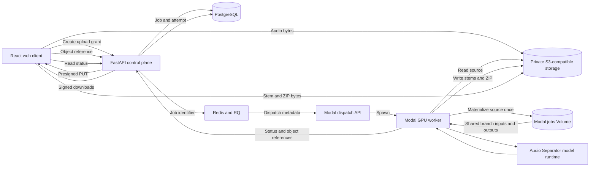
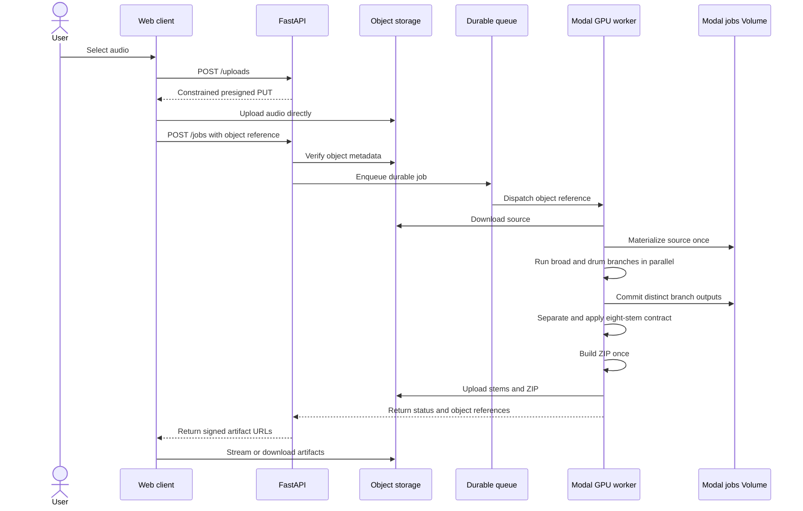

# Production architecture

This document defines the target architecture for the eight-stem product and
records which boundaries exist in code. It separates implemented foundations
from configured infrastructure and measured production evidence.

## Architecture decision

The API is a control plane. It owns authorization, job metadata, policy, and
signed access. It must not proxy large audio uploads, model outputs, or ZIP
downloads in the production path. Modal remains the GPU execution plane, and a
private S3-compatible store is the media data plane.

No audited open-source separator provides this complete cloud architecture.
The design combines the maintained `python-audio-separator` runtime, selected
StemDeck lifecycle patterns, UVR model semantics, and standard durable cloud
control-plane patterns.

## Component architecture

The target system keeps media bytes outside the API and uses immutable object
references between components.



## Job sequence

The production request path sends metadata through application services and
sends audio bytes directly between the client, object store, and GPU worker.



## Component responsibilities

Each component has one primary responsibility so scaling or replacing it does
not change the eight-stem product contract.

| Component | Owns | Must not own |
| --- | --- | --- |
| Web client | Upload UX, progress, playback, and downloads | Cloud credentials or model policy |
| FastAPI | Identity, policy, job metadata, and signed access | Large media transfer or GPU inference |
| PostgreSQL | Jobs, attempts, artifacts, model releases, and usage | Audio blobs |
| Redis and RQ | Durable dispatch, retries, and backpressure | Canonical job state |
| Modal worker | Inference, contract finalization, and packaging | User authorization or billing |
| Object storage | Private source audio, stems, manifests, and bundles | Job transitions or product policy |
| Model runtime | Checkpoint loading and separation inference | Product publication decisions |

## Non-negotiable invariants

These invariants prevent the prototype bottlenecks and quality claims from
returning during later implementation.

- The production API process transfers zero audio bytes after issuing an
  upload grant.
- Object references are bucket- and prefix-scoped before use.
- The GPU worker packages a completed output once.
- API responses generate short-lived URLs and never persist signed URLs.
- PostgreSQL becomes the authority for job state before multiple API instances
  are enabled.
- Queue delivery is at least once, while job execution is idempotent.
- A model output is not called benchmark-qualified because a file exists.
- Model release identifiers, timings, quality results, and object metadata are
  recorded for every production attempt.
- Legacy local paths remain explicit fallbacks and never silently replace the
  production GPU contract.

## Implementation status

The object data-plane boundary is deployed in an isolated Modal application.
B2 handles external inputs and final artifacts; a shared Modal Volume handles
parallel branch exchange. Supabase PostgreSQL, Upstash Redis and RQ, and
Supabase JWT verification are configured and live-verified. Production
promotion still requires retention, deletion, cross-tenant, and quality work.

| Capability | Status | Evidence |
| --- | --- | --- |
| Presigned direct upload | Implemented, B2 verified | `POST /uploads` |
| Object-reference job creation | Implemented, B2 verified | `POST /jobs` |
| GPU-side source materialization | Deployed and warm-measured | `volume-direct-warm-60s-v1` |
| GPU-side contract finalization | Implemented | Modal worker |
| GPU-side object publication | Deployed and warm-measured | `volume-direct-warm-60s-v1` |
| Signed artifact responses | Implemented, B2 configured | `GET /jobs/<id>` |
| Legacy multipart and local artifacts | Retained | Compatibility path |
| PostgreSQL job authority | Supabase configured and migrated | Live lifecycle probe |
| Redis and RQ dispatch | Upstash native TLS queue verified | Live RQ probe |
| Atomic admission and per-owner limits | Implemented, race drill pending | Phase 4 |
| Idempotency and valid transitions | Implemented, race drill pending | Phase 4 |
| Renewable leases and reconciliation | Managed takeover drill passed | `benchmarks/reliability/managed-recovery-drills-2026-07-19.json` |
| Truthful queued and Modal cancellation | Queue cancellation verified | Live RQ probe |
| Durable polling event feed | Implemented, not live-verified | `GET /jobs/<id>/events` |
| Terminal job deletion and expiry sweep | Implemented, not scheduled | Phase 4 |
| JWT ownership checks | Supabase ES256 token verified | Live FastAPI route probe |
| Uvicorn, health, and Prometheus | Implemented; ASGI load report pending | Phase 7 |
| Ground-truth model qualification | Candidate rejected after nine valid songs | `benchmarks/results/release-30-l4-l4-v1-scorecard.json` |

## Storage configuration

Set these values in the API environment and in the Modal secret named by
`OBJECT_STORAGE_MODAL_SECRET`. Standard AWS credential names are also
accepted.

- `OBJECT_STORAGE_BACKEND=s3`
- `OBJECT_STORAGE_BUCKET`
- `OBJECT_STORAGE_PREFIX`
- `OBJECT_STORAGE_ENDPOINT_URL` for services such as Cloudflare R2
- `OBJECT_STORAGE_REGION`
- `OBJECT_STORAGE_ACCESS_KEY_ID`
- `OBJECT_STORAGE_SECRET_ACCESS_KEY`
- `OBJECT_STORAGE_SESSION_TOKEN` when temporary credentials are used
- `OBJECT_STORAGE_PRESIGN_TTL`
- `OBJECT_STORAGE_MAX_BYTES`
- `OBJECT_STORAGE_MODAL_SECRET`

Use least-privilege credentials scoped to the selected bucket and prefix. Do
not commit credentials or signed URLs.

## Remaining migration

The next migration work completes the remaining safety and release gates
without changing the media contract introduced here.

1. Run migration rollback and cross-tenant cancellation-race drills.
2. Pass cross-tenant authorization tests with two managed identities.
3. Reconcile the closed Modal billing interval for the warm Volume run.
4. Schedule `scripts/cleanup_expired_jobs.py`, add a bucket lifecycle rule for
   abandoned direct uploads, and test deletion and backup restoration.
5. Replace the rejected guitar path and weak piano path, then restart the
   frozen ground-truth, matched-commercial, and blind-listening qualification.

## Verification

The automated suite covers the local fallback, direct-upload contract, object
reference validation, worker dispatch, object artifact manifests, and signed
download generation. It does not replace a real provider and Modal benchmark.

Run the suite with:

```bash
/home/ayodele/Desktop/marlon-music/venv/bin/python -m pytest -q
```

## Next steps

Run cross-tenant and restore drills against the activated control plane. Do
not promote the eight-stem candidate until guitar and piano are replaced, the
frozen qualification passes, and actual Modal billing is reconciled.
