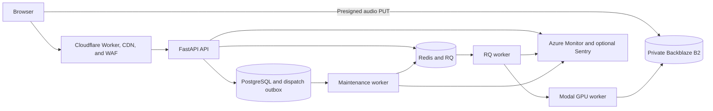

# Production platform

This document defines the non-billing production platform. The implementation
keeps one control plane, one durable queue transport, one media data plane, and
one GPU execution plane. It does not introduce Kubernetes or additional
microservices before operating evidence requires them.

## Standard stack

The public request path uses Cloudflare as the only browser-facing gateway.
Azure runs stateless application processes, while managed providers own durable
state and GPU execution.

Cloudflare serves immutable frontend assets and proxies `/api` requests. The
worker removes any client-provided origin-verification header and adds its own
secret. The API rejects production traffic that does not carry the secret.
Health probes remain available directly to Azure.

## Reference implementations

The implementation adapts maintained patterns instead of copying an unrelated
application wholesale.

| Concern | Reference | Pattern adopted |
| --- | --- | --- |
| FastAPI boundaries | `fastapi/full-stack-fastapi-template` | Validated settings, separate prestart work, health checks, release workflows, and Sentry integration |
| Media lifecycle | `immich-app/immich` | Private media, separate background workers, explicit maintenance, health checks, and scheduled backup jobs |
| Queue operations | `paperless-ngx/paperless-ngx` | Separate broker, database, web, consumer, and scheduled maintenance responsibilities |
| Azure hosting | `Azure-Samples/rag-postgres-openai-python` | Bicep modules, Container Apps, managed identity, ACR, Log Analytics, and Application Insights |
| Edge frontend | `cloudflare/workers-sdk` | Static Next.js assets, a typed edge gateway, observability, and source maps |
| Audio execution | Existing project boundary | Modal remains the isolated GPU execution provider |

Reference code is not a runtime dependency.

## Reliability contract

PostgreSQL stores the job and a dispatch-outbox row in one transaction. The API
attempts immediate RQ dispatch, but a process crash cannot lose the job. The
maintenance worker claims pending outbox rows with `SKIP LOCKED`, retries
idempotent RQ enqueue, reconciles stale execution leases, and deletes expired
terminal jobs.

The queue provides at-least-once delivery. The PostgreSQL lease provides
single-owner execution. RQ job identifiers and application idempotency keys
make duplicate delivery safe.

## Security contract

Production startup fails unless the following controls are configured:

- Cloudflare origin verification.
- Explicit trusted hosts and CORS origins.
- JWT verification with issuer, audience, expiry, issued-at, and subject claims.
- Redis-backed shared rate limits.
- Authenticated Prometheus metrics.
- Private principal-scoped object keys and short-lived signed URLs.
- PostgreSQL, Redis/RQ, object storage, GPU worker, and telemetry providers.
- Disabled multipart uploads.

Cloudflare applies the first traffic limit. Redis applies a second limit shared
by all API replicas. PostgreSQL separately enforces global and per-owner active
job capacity.

## Implementation status

The repository contains the application behavior and deployment definitions.
Provider activation still requires account credentials.

| Capability | Repository state |
| --- | --- |
| Cloudflare Worker gateway | Implemented in `apps/web/worker.ts` |
| Next.js static asset bundle | Implemented by `apps/web/next.config.ts` and `apps/web/wrangler.jsonc` |
| Cloudflare WAF and rate limits | Implemented in `infra/cloudflare/` |
| Azure Container Apps | Implemented in `infra/azure/main.bicep` |
| Immutable ACR image deployment | Implemented in the production workflow |
| PostgreSQL dispatch outbox | Implemented in migration `003` |
| Redis/RQ dispatch | Implemented |
| Recovery and retention worker | Implemented |
| Scheduled database backup | Implemented as an Azure Container Apps job |
| Guarded database restore | Implemented as an operator command |
| Azure Monitor and optional Sentry | Implemented |
| CodeQL, dependency review, and Trivy | Implemented in CI |
| Provider-backed deployment | Requires production account variables and secrets |
| Model quality qualification | Deliberately postponed |

## Next steps

Follow the
[production deployment runbook](../operations/PRODUCTION_DEPLOYMENT.md), then
run the [disaster recovery drill](../operations/DISASTER_RECOVERY.md). Do not
describe the platform as deployed until both workflows complete against the
real provider accounts.
