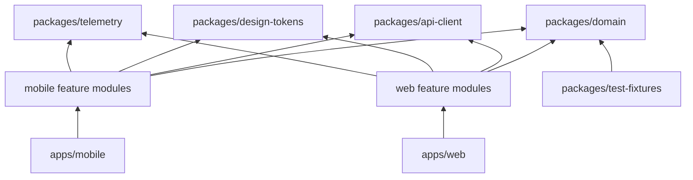
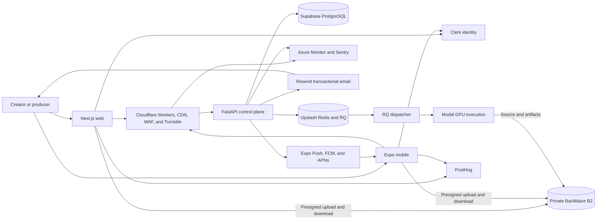
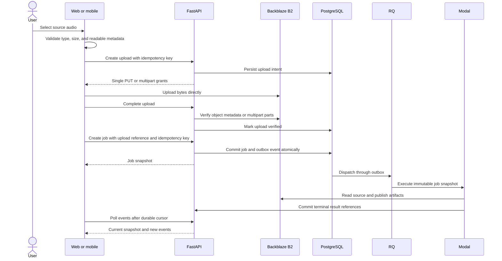

# Web and mobile system architecture

This document locks the product-client architecture for StemSplitter. It is the
implementation authority for the web application, mobile application, shared
TypeScript packages, client-facing API changes, audio transport, testing, and
release engineering. It extends the existing production architecture without
replacing the FastAPI control plane, PostgreSQL authority, Redis and RQ
dispatch, Modal execution plane, Backblaze B2 data plane, or Cloudflare edge.

The design uses one deliberate architecture rather than merging complete
starter repositories. Official Expo workspace behavior is the foundation.
Selected, bounded patterns come from maintained open-source projects. Every
adopted pattern has a named purpose, and every rejected framework has a stated
reason.

## Decision status

The decisions in this document are locked for the first production release.
Changing one requires an architecture decision record that identifies the
measured requirement the current choice cannot satisfy.

The implementation must preserve these outcomes:

- One product contract serves the web, iOS, Android, and self-hosted web.
- FastAPI remains the only product API and authorization authority.
- Clients transfer media directly to and from private object storage.
- Web and mobile share domain code, not platform user-interface code.
- The studio transport uses one clock and bounded memory for all stems.
- Job, upload, and playback recovery works after refresh, reconnect, or app
  suspension without creating duplicate GPU work.
- Release checks prove behavior instead of checking only that builds complete.

## Diagnosis

The repository has a credible control plane and GPU execution boundary, but
the client layer is incomplete. The former React and Vite application is now a
frozen behavioral baseline; the active web runtime is Next.js in `apps/web/`
with a generated client in `packages/api-client/`. The repository still has no
mobile application, authenticated project library, resumable upload protocol,
production multitrack transport, client telemetry, or complete browser and
device verification.

Generic full-stack starters do not fit this system. Most assume a JavaScript
backend, proxy application data through a web framework, or optimize for forms
and database CRUD. StemSplitter instead has long-running jobs, private media,
GPU costs, expiring artifacts, synchronized audio, app suspension, and two
independent release systems.

The core architecture problem is therefore not selecting the framework with
the most features. It is keeping authority and media flow correct while giving
both clients a coherent, recoverable audio-first experience.

## Guiding policies

The implementation follows a small standard kit and adds a dependency only
when a named product requirement needs it.

- Preserve working backend boundaries instead of rewriting them for a starter.
- Prefer official framework behavior over custom Metro or bundler patches.
- Keep server state, device state, and audio-engine state separate.
- Generate API types from FastAPI and never duplicate request or response
  interfaces manually.
- Share tokens and domain rules while allowing web and native interaction
  patterns to differ.
- Keep high-frequency audio timing outside the React render loop.
- Treat signed URLs as renewable capabilities, not durable application data.
- Treat upload completion and job creation as separate, idempotent operations.
- Use feature folders and enforce dependency direction in CI.
- Make preview, staging, and production distinct release channels.
- Prefer measurable budgets over claims such as "fast" or "production-ready."

## Reference implementation decisions

The reference repositories are design inputs, not runtime dependencies or
wholesale templates. This prevents their backend, styling, authentication, and
deployment assumptions from leaking into the product.

| Reference | Adopt | Reject |
| --- | --- | --- |
| [Expo monorepo guide](https://docs.expo.dev/guides/monorepos/) | Workspace layout, automatic Metro configuration, native-module deduplication, and app-local EAS files | Custom Metro watch folders and legacy hoisting patches |
| [Expo runtime-version guide](https://docs.expo.dev/eas-update/runtime-versions/) | Fingerprint runtime versions, preview channels, staged updates, and rollback | Sending native-incompatible code through an over-the-air update |
| [Expo Router authentication guide](https://docs.expo.dev/router/advanced/authentication/) | Typed protected routes and deep-link restoration | Treating a client route guard as API authorization |
| [Obytes React Native template](https://github.com/obytes/react-native-template-obytes) | Environment validation, development/preview/production EAS profiles, Expo Doctor, Maestro flows, feature folders, and release workflow separation | Expo SDK 54 pin, Axios wrappers, Uniwind styling, template branding, and single-app layout |
| [Ignite](https://github.com/infinitered/ignite) | Dependency-cruiser rules, native error screens, testable storage adapters, Maestro conventions, and platform debugging practices | React Navigation as the route authority, apisauce, generated demo screens, and its full component kit |
| [create-t3-turbo](https://github.com/t3-oss/create-t3-turbo) | `pnpm` workspace catalog, Turborepo task graph, shared tooling packages, workspace linting, and grouped dependency updates | tRPC, Better Auth, Drizzle, direct Supabase data access, and shared web UI assumptions |
| [Bulletproof React](https://github.com/alan2207/bulletproof-react) | Feature-first web modules, one-way imports, API isolation, MSW, Playwright, and application-level composition | Its old dependency versions, Axios, Redux-style global state by default, and copied example features |
| [Bluesky Social App](https://github.com/bluesky-social/social-app) | Platform-specific files, per-platform type checks, native modules in-repo, EAS channels, nightly Maestro, release rollback, and localization discipline | Its single universal React Native web renderer, webpack path, social-product state model, and application scale |
| [React Native Audio API](https://github.com/software-mansion/react-native-audio-api) | Shared `AudioContext`, scheduled sources, gain graph, bounded buffer queues, analyzer support, and an Expo config plugin | Full-file PCM decoding for long stems and undocumented codec or background assumptions |
| [Backblaze S3-compatible API](https://www.backblaze.com/docs/en/cloud-storage-call-the-s3-compatible-api) | Presigned access, multipart creation, part upload, completion, abort, and private object storage | Permanent download URLs and client-held application keys |
| [Clerk Expo SDK](https://clerk.com/docs/expo/getting-started/quickstart) | One managed identity, native token persistence, and deep-link completion | Direct client access to product tables or backend credentials |
| [Next.js App Router](https://nextjs.org/docs/app) | Static and dynamic rendering, route layouts, metadata, error boundaries, and client-component isolation for the studio | A second product API, direct database access, or job orchestration in Server Actions |
| [Cloudflare Next.js guide](https://developers.cloudflare.com/workers/framework-guides/web-apps/nextjs/) | OpenNext deployment, Workers runtime verification, static assets, SSR, SSG, ISR, and streaming | Assuming Vercel-specific behavior without a Cloudflare preview test |
| [Clerk email delivery](https://clerk.com/docs/guides/development/customization/email-sms-templates) | Managed authentication delivery and versioned templates | Mixing product-notification delivery into authentication flows |
| [Cloudflare Turnstile](https://developers.cloudflare.com/turnstile/get-started/) | Server-verified bot defense on abuse-sensitive anonymous flows | Client-only verification or challenges on every authenticated request |
| [Expo push notifications](https://docs.expo.dev/push-notifications/overview/) | Cross-platform completion notifications through Expo, FCM, and APNs | Treating push delivery as authoritative job state |

The references answer different questions. Expo is the workspace authority,
Obytes supplies mobile delivery mechanics, Ignite supplies enforceable native
boundaries, create-t3-turbo supplies monorepo mechanics, Bulletproof React
supplies web module boundaries, and Bluesky proves how platform-specific code
and releases behave in a large public application.

## Locked standard stack

The standard kit below is the complete default. Internal packages may use only
these choices unless an architecture decision record approves a replacement.

| Concern | Locked choice | Reason |
| --- | --- | --- |
| JavaScript runtime | Node.js 24 LTS | Current long-lived runtime and compatible with active production references |
| Package manager | `pnpm` 10 with isolated dependencies | Deterministic workspaces and explicit dependency ownership |
| Task graph | Turborepo 2 | Cached, dependency-aware lint, type, test, and build tasks |
| Web | Next.js App Router, React 19, and TypeScript 5.9 | One hybrid marketing and product client with explicit server and client boundaries |
| Web rendering | Static generation or ISR for public discovery routes; client components for the authenticated studio | Search-visible HTML without forcing browser audio state through a server runtime |
| Mobile | Expo SDK 57 and its pinned React Native version | Current supported Expo baseline with first-class workspaces |
| Mobile routing | Expo Router with typed and protected routes | Native deep links and filesystem route ownership |
| Server state | TanStack Query 5 | Caching, cancellation, retry policy, and reconnect behavior |
| Studio state | Zustand 5 with selector subscriptions | High-frequency mixer state without broad React rerenders |
| Forms | React Hook Form and Zod 4 | Local validation and accessible form behavior |
| API client | `openapi-typescript` and `openapi-fetch` | Keeps FastAPI OpenAPI as the contract authority |
| Localization | Lingui 5 and platform `Intl` APIs | Extractable messages and one catalog format across clients |
| Web styling | Existing CSS, cascade layers, and generated CSS variables | Preserves the approved visual language without a utility framework rewrite |
| Mobile styling | React Native `StyleSheet` and generated typed tokens | Native performance and explicit platform behavior |
| Motion | CSS motion on web; Reanimated on mobile | Platform-native execution and reduced-motion control |
| Mobile audio | React Native Audio API behind `TransportEngine` | One native audio graph and schedulable multitrack sources |
| Web audio | Web Audio API behind `TransportEngine` | Native browser graph, gain control, and a shared master clock |
| Mobile secure storage | Expo SecureStore | Keychain and Android Keystore-backed session storage |
| Mobile cache metadata | Expo SQLite key-value storage | Durable, queryable upload and active-job recovery state |
| Web unit tests | Vitest, React Testing Library, and MSW | Fast behavior and contract tests |
| Mobile unit tests | Jest Expo and React Native Testing Library | Supported native component test environment |
| Web end-to-end tests | Playwright with axe checks | Multi-browser workflows and accessibility assertions |
| Mobile end-to-end tests | Maestro on development builds | Device-level Android and iOS flows |
| Client error reporting | Sentry | Release-aware web and native crash evidence |
| Server observability | Existing OpenTelemetry-compatible Azure signals | Preserves one server telemetry path |
| Product analytics | PostHog Cloud EU | Funnels, retention, cohorts, feature flags, experiments, and privacy-controlled replay |
| Authentication | Clerk identity and FastAPI JWT verification | One managed identity authority across web and mobile |
| Transactional email | Clerk authentication delivery and Resend server-side product messages | Separate auth delivery from versioned product communication |
| Web abuse defense | Cloudflare Turnstile with mandatory FastAPI verification | Protects signup, recovery, imports, and anonymous job admission before paid work |
| Mobile notifications | Expo Push Service over FCM and APNs | One native delivery path for non-authoritative completion hints |
| Search discovery | Next.js metadata, JSON-LD, sitemap, robots, Google Search Console, and Bing Webmaster Tools | Indexable public pages and measurable search health without an SEO SaaS dependency |
| Web hosting | Next.js on Cloudflare Workers through OpenNext | Keeps CDN, edge security, hybrid rendering, and origin verification on Cloudflare |
| Native delivery | EAS Build, Submit, Update, and fingerprint runtime versions | Reproducible store builds and safe staged over-the-air updates |
| Dependency updates | Renovate with grouped Expo and workspace updates | Prevents incompatible piecemeal native updates |

React is not hoisted blindly across clients. Expo owns the compatible React and
React Native versions for `apps/mobile`. The web app owns its React version.
Shared packages declare React as a peer dependency only when they actually use
it and must not bundle React.

## Explicitly rejected choices

The following choices are rejected for the first production release. This list
prevents repeated framework debates during implementation.

- Do not add Remix, React Router framework mode, TanStack Start, Astro, or Expo
  Router web beside Next.js.
- Do not add tRPC, GraphQL, or a second JavaScript API in front of FastAPI.
- Do not put product authority, PostgreSQL access, queue dispatch, object-store
  credentials, or Modal orchestration in Next.js Route Handlers or Server
  Actions. FastAPI remains the only product backend.
- Do not adopt Solito. Web and mobile share domain packages and design tokens,
  not routing or user-interface components.
- Do not adopt Tamagui, NativeWind, or Uniwind as the design authority.
- Do not create one universal UI package for web and native components.
- Do not use Redux for server state or audio timing.
- Do not add Kafka, Temporal, Kubernetes, or another job authority.
- Do not add Datadog alongside Azure Monitor and Sentry. Reconsider Datadog
  only as a deliberate replacement for the operational observability stack,
  not as the product analytics provider.
- Do not proxy source audio, stems, or ZIP files through FastAPI.
- Do not persist presigned URLs in PostgreSQL or local client storage.
- Do not use Expo Go as the production development environment. Native audio
  and secure configuration require development builds.
- Do not promise background studio playback in the first release. Jobs continue
  on the server, but the studio pauses safely when the app is suspended.

## Target repository structure

The repository remains a polyglot monorepo. Python runtime code keeps its
current package paths; only the client code moves into a standard workspace.
This avoids a high-risk backend relocation that produces no product value.

```text
StemSplitter-Audio-Separation-Server/
├── apps/
│   ├── web/
│   │   ├── public/
│   │   ├── src/
│   │   │   ├── app/
│   │   │   ├── components/
│   │   │   ├── features/
│   │   │   ├── lib/
│   │   │   └── styles/
│   │   ├── next.config.ts
│   │   ├── open-next.config.ts
│   │   └── wrangler.jsonc
│   └── mobile/
│       ├── app/
│       ├── src/
│       │   ├── components/
│       │   ├── features/
│       │   ├── lib/
│       │   └── native/
│       ├── app.config.ts
│       └── eas.json
├── packages/
│   ├── api-client/
│   ├── design-tokens/
│   ├── domain/
│   ├── telemetry/
│   └── test-fixtures/
├── tooling/
│   ├── eslint/
│   └── typescript/
├── splitter/
├── workers/
├── migrations/
├── tests/
├── infra/
├── package.json
├── pnpm-workspace.yaml
├── turbo.json
└── pyproject.toml
```

The current `frontend/` directory moves once, with Git history, to `apps/web/`.
Docker, Cloudflare, Makefile, CI, and deployment paths change in the same atomic
migration. No compatibility copy of `frontend/` remains after the migration.

## Dependency direction

Dependency direction is enforced rather than documented as a suggestion. A
feature may depend on shared domain code, but shared code may not import an app
or another feature.



The rules are:

- `packages/` never imports from `apps/`.
- Feature modules never import from sibling feature modules.
- App routes compose features and shared components.
- `api-client` contains transport and generated API types, not product state.
- `domain` contains pure types, state transitions, format rules, and stable
  error mappings with no DOM, React Native, Clerk, or storage imports.
- Platform storage, audio, analytics, and navigation implementations remain in
  their app.
- Dependency Cruiser checks circular, orphaned, unresolved, and forbidden
  imports. ESLint checks feature boundaries during normal editing.

## System context

Web and mobile are equal clients of the FastAPI control plane. Neither client
becomes a backend for the other, and neither receives cloud credentials.



Cloudflare remains the public application gateway. Native clients use the same
public API hostname as web clients. The edge applies coarse abuse controls; the
API applies identity, rate, quota, ownership, and job-admission policy.

## State ownership

Each kind of state has one authority. Caches can improve experience but cannot
create a second source of truth.

| State | Authority | Client copy | Recovery rule |
| --- | --- | --- | --- |
| Identity and session | Clerk identity | SecureStore on mobile; official web session adapter | Refresh or sign in again; never infer authentication locally |
| Job and attempt status | PostgreSQL | TanStack Query cache | Refetch by job identifier and event cursor |
| Upload grant | FastAPI policy | In-memory only | Request a new grant when expired |
| Multipart upload session | PostgreSQL and B2 upload identifier | SQLite or IndexedDB recovery record | Reconcile uploaded parts, then continue or abort |
| Signed artifact URL | FastAPI-generated capability | In-memory only | Refresh when near expiry or after a 401/403 |
| Project list | PostgreSQL | Persisted query cache for display only | Server data replaces cached data after reconnect |
| Mixer controls | Device-local studio state | Zustand store | Restore volumes and loop; never restore active playback automatically |
| Playback clock | Platform audio engine | Coarse React snapshot | Audio graph remains authoritative while mounted |
| Product capabilities | FastAPI `GET /capabilities` | Versioned query cache | Disable stale actions until refreshed |
| Model release and provenance | PostgreSQL job snapshot | Read-only job metadata | Never replace with current global model metadata |

## Client application architecture

Both clients use the same feature vocabulary while retaining platform-native
routes and components. This makes product behavior comparable without forcing
browser controls into a mobile interaction model.

The initial feature set is:

- `auth`: sign in, sign out, recovery, session expiry, and protected routes.
- `source`: upload selection, Audius selection, metadata, and rights notice.
- `submission`: capability selection, preflight, estimate, and confirmation.
- `jobs`: active state, durable events, cancellation, retry, and errors.
- `projects`: cursor-paginated history, search, rename, delete, and expiry.
- `studio`: waveform, synchronized transport, stem controls, and A/B.
- `exports`: individual downloads, archive download, and native share sheet.
- `feedback`: quality rating and issue report tied to job and model release.
- `settings`: account, storage, notifications, privacy, and diagnostics.

Web routes are fixed as follows:

```text
/
/login
/recover
/studio/new
/projects
/projects/:jobId
/settings
/privacy
/terms
```

Mobile routes are fixed as follows:

```text
app/
├── _layout.tsx
├── (auth)/
│   ├── login.tsx
│   └── recover.tsx
├── (app)/
│   ├── _layout.tsx
│   ├── new.tsx
│   ├── projects/
│   │   ├── index.tsx
│   │   └── [jobId].tsx
│   └── settings.tsx
└── +not-found.tsx
```

Route files perform composition and route-level loading only. Business logic
lives in feature modules. Expo Router protected routes enforce client
navigation, while FastAPI ownership checks remain the security boundary.

## API contract and required deltas

FastAPI OpenAPI remains the only request and response schema authority. CI
generates the OpenAPI document and TypeScript types, then fails when generated
files differ from the committed contract.

The existing routes for capabilities, direct uploads, job creation, job status,
events, cancellation, resume, deletion, manifests, and Audius remain. The full
client requires these additions:

| Route | Purpose | Authority and safety rule |
| --- | --- | --- |
| `GET /v1/me` | Return identity, limits, consent state, and feature cohort | Derived from verified JWT and server policy |
| `GET /v1/jobs` | Cursor-paginated project history with status and text filters | Owner-scoped query with stable cursor |
| `PATCH /v1/jobs/{id}` | Rename user-visible project metadata | Does not mutate source, model release, or manifest |
| `POST /v1/uploads/multipart` | Start resumable upload for files above the single-PUT threshold | Creates owner-scoped upload record and B2 upload ID |
| `POST /v1/uploads/{id}/parts` | Sign a bounded batch of part numbers | Validates owner, state, size, expiry, and allowed part range |
| `POST /v1/uploads/{id}/complete` | Verify and complete all uploaded parts | Server verifies B2 part list before accepting object input |
| `DELETE /v1/uploads/{id}` | Abort an incomplete upload | Idempotently aborts B2 and marks the record terminal |
| `POST /v1/jobs/{id}/playback-session` | Return renewable URLs for playback proxies and waveform peaks | URLs are short-lived, owner-scoped, and never persisted |
| `GET /v1/playback-sessions/{id}/{stem}.m3u8` | Return an HLS playlist containing presigned segment URLs | Transfers metadata only; media remains direct from B2 |
| `POST /v1/jobs/{id}/feedback` | Record structured quality feedback | Binds feedback to job, stem, and immutable model release |
| `POST /v1/devices` | Register an Expo push token for completion notices | Owner- and installation-scoped with token rotation |
| `DELETE /v1/devices/{id}` | Revoke a device token | Idempotent and owner-scoped |

All mutation routes accept an `Idempotency-Key`. Error responses use one
versioned problem-details envelope with a stable `code`, safe `detail`, request
identifier, retryability, and field errors. Clients switch on `code`, never on
human-readable text.

The history, multipart, playback-session, feedback, and device routes are
contract gaps. UI implementation cannot mark their dependent flows complete
until these routes exist and have ownership tests.

## API compatibility and feature control

Native releases cannot change at the same speed as the web client. The API
must therefore have an explicit compatibility contract before the first store
submission.

All product routes move behind `/v1` before native release. Existing
unversioned routes remain temporary compatibility aliases for the current web
deployment and are removed only after usage reaches zero. Additive fields
remain optional for clients. Removing or changing a field, status, or error
code requires a new major API prefix.

Every client sends these headers:

- `X-Client-Platform`: `web`, `ios`, or `android`.
- `X-Client-Version`: semantic application version.
- `X-Client-Build`: immutable web release or native build number.
- `X-API-Contract`: generated client contract version.

`GET /v1/capabilities` returns the API contract version, minimum supported
client version per platform, maintenance state, enabled input providers,
qualified profiles and stems, upload limits, playback-proxy version, and
feature-cohort assignments. The API can disable submission or playback without
disabling account access, project history, downloads, or deletion.

The backend supports the current and previous production mobile contract for
at least 90 days. An unsupported client receives a stable
`client_upgrade_required` problem code and a store URL. The client can still
sign in, export existing artifacts, and delete data unless a security incident
requires a hard block.

## Upload and job lifecycle

Upload and job creation form one recoverable workflow but remain separate
transactions. This prevents a network retry from launching duplicate GPU work.



Files below the configured threshold use one presigned PUT. Larger files use
B2 multipart upload. The client stores only the upload identifier, source file
fingerprint, completed part metadata, and expiry. It never stores storage
credentials or assumes a presigned URL can be reused after expiry.

The client computes a stable local source fingerprint from size, modification
time, and sampled content before upload. The server remains responsible for the
final object checksum and metadata verification. A resumed upload must match
the original local fingerprint.

Web persists incomplete upload recovery data in IndexedDB. Mobile persists it
in Expo SQLite. When the app resumes, it reconciles the server upload state and
B2 part list before sending another byte. It does not create a job until the
server marks the upload verified.

## Job progress and reconnect behavior

Durable cursor polling remains the progress transport. It works through mobile
network changes, process restarts, and ordinary HTTP infrastructure without
making an open connection another state authority.

The client follows this polling policy:

- Poll every two seconds while a visible job is active.
- Poll every ten seconds when the application is foregrounded but the job is
  not visible.
- Stop polling when the app is backgrounded and refresh immediately on resume.
- Use the latest event cursor and conditional response headers.
- Apply exponential backoff with full jitter for transport failures.
- Honor server retry hints and stop retrying terminal errors.
- Refetch the full job snapshot whenever the event cursor is invalid or a state
  transition is missing.
- Register a native push notification only as a completion hint; opening the
  notification always refetches the authoritative job.

Server-sent events are not part of the first release. They can reduce visible
latency but do not improve job durability, and the existing workload does not
justify another connection lifecycle.

## Professional multitrack transport

The studio transport is a product subsystem, not a collection of eight player
components. It owns one clock, one state machine, one output graph, and one
bounded prefetch policy.

The worker publishes two artifact classes for each qualified stem:

- A lossless WAV export for download and DAW use.
- A normalized HLS playback proxy encoded consistently across every stem.

The worker also publishes one versioned waveform-peak file per stem. Peak files
contain bounded min/max windows and timing metadata, so clients never download
or decode a full WAV merely to draw a waveform.

Each HLS proxy uses AAC-LC in fragmented MP4 with fixed-duration,
independently decodable segments. Every stem uses identical segment
boundaries, codec settings, presentation timestamps, and timeline origin. The
worker stores a playlist template and immutable media segments in B2. It does
not store signed URLs.

`POST /v1/jobs/{id}/playback-session` creates a short-lived database session
and returns one scoped playlist URL per stem. The playlist endpoint returns
text containing presigned B2 segment URLs whose expiry exceeds the source
duration plus a bounded safety window. FastAPI transfers playlist metadata but
never audio bytes. The browser or native decoder fetches every media segment
directly from B2.

The playback manifest records source duration, sample rate, channel count,
codec, segment duration, encoder delay, initial padding, peak-window duration,
artifact checksums, and model release. Playback sessions can be renewed, but
the immutable manifest and segment objects cannot change.

The shared `TransportEngine` contract exposes these operations:

```ts
type TransportEngine = {
  load(manifest: PlaybackManifest): Promise<void>;
  play(): Promise<void>;
  pause(): Promise<void>;
  seek(seconds: number): Promise<void>;
  setGain(stem: StemId, linearGain: number): void;
  setMuted(stem: StemId, muted: boolean): void;
  setSoloed(stems: ReadonlySet<StemId>): void;
  setLoop(loop: { start: number; end: number } | null): void;
  subscribe(listener: (snapshot: TransportSnapshot) => void): () => void;
  dispose(): Promise<void>;
};
```

The contract contains no React types. React subscribes to coarse snapshots with
`useSyncExternalStore`; the audio thread or browser graph owns timing. Volume,
mute, and solo operations update gain nodes directly and do not wait for a
React rerender.

The web adapter uses one Web Audio `AudioContext`. `hls.js` supplies HLS on
browsers without native HLS support. Prebuffered media sources feed per-stem
gain nodes and one master output. A readiness barrier prevents playback until
every selected stem can start from the requested segment. A monotonic master
clock controls play, pause, seek, and loop. The adapter measures drift and
corrects only when skew crosses the accepted threshold, avoiding constant
audible rescheduling.

The mobile adapter uses React Native Audio API in an Expo development build.
All HLS streamer sources share one native `AudioContext`, prebuffer against one
readiness barrier, use scheduled starts, and feed per-stem gain nodes. The app
caches a bounded number of segments around the playhead and never decodes a
full song into PCM. It pauses and safely releases the active graph when it
enters the background.

`expo-audio` is not the studio transport. It can support simple single-file
auditioning outside the studio, but independent players are not the authority
for synchronized stems.

The transport must pass these release gates on Chrome, Safari, Firefox, iOS,
and Android reference devices:

| Measure | Required result |
| --- | --- |
| Initial inter-stem skew | Median at most 10 ms and p95 at most 20 ms |
| Skew after 30 minutes | p95 at most 20 ms without cumulative drift |
| Seek convergence | Every audible stem reaches target within 100 ms |
| Loop boundary error | At most 20 ms after two complete loops |
| Gain response | Audible update within 50 ms without click or clipping |
| Memory | At most 250 MB incremental memory for an eight-stem five-minute job |
| URL expiry | Playback renews capability and resumes without restarting job |
| Interruption | Phone call, route change, and app background produce a safe pause |
| Cleanup | Leaving studio releases network, decoder, and audio graph resources |

If React Native Audio API cannot pass these gates, only the mobile
`TransportEngine` adapter is replaced with an in-repository Expo native module.
The product, API, state, and UI architecture remain unchanged. This is an
explicit replacement boundary, not an unresolved framework choice.

## Design-system implementation

The approved product design remains platform-specific in composition but uses
one token authority. A generated token package prevents color, type, spacing,
radius, shadow, and motion values from drifting.

`packages/design-tokens` owns semantic tokens such as `surface.canvas`,
`surface.glass`, `text.primary`, `accent.signal`, `border.quiet`, and
`motion.enter`. It generates:

- CSS custom properties for web.
- Typed TypeScript objects for React Native.
- Figma-compatible token JSON for design synchronization.
- A static token reference used by visual regression tests.

Web uses cascade layers in this order: reset, tokens, base, components,
features, and utilities. Mobile uses small native primitives for text, button,
surface, field, feedback, and sheet. Feature components compose those
primitives without importing web markup or CSS.

The design system includes reduced motion, dynamic text, screen-reader labels,
keyboard focus, high contrast, safe areas, touch targets, loading skeletons,
empty states, destructive confirmations, and stable success and error feedback.
Glass effects remain decorative and must preserve contrast without them.

## Web delivery, discovery, and security headers

Next.js owns both the public product site and authenticated web application.
Public discovery routes use static generation by default and ISR only when
content must change without a full deployment. Authenticated routes and every
user-specific project URL are excluded from indexing. The studio remains a
client-component island so Web Audio, waveform state, and signed media access
never depend on React Server Component execution.

The first public route set includes the landing page, feature explanations,
pricing when billing is approved, competitor comparisons, legal pages, and a
repository-owned MDX article collection. A content management system is added
only when a non-engineering publishing workflow becomes a measured need.

The web build owns unique titles and descriptions, canonical URLs, Open Graph
and social metadata, a sitemap, `robots.txt`, application icons, theme colors,
and validated JSON-LD. Google Search Console and Bing Webmaster Tools verify
ownership, indexing, sitemap processing, Core Web Vitals, and crawl failures.
The hero poster is the initial visual; video loads after the critical content
and respects reduced motion and data-saving signals.

Cloudflare applies versioned security headers:

- Content Security Policy with explicit API, Clerk, Sentry, PostHog,
  Turnstile, B2, media, and font origins.
- HTTP Strict Transport Security after staging proves every subdomain uses
  HTTPS.
- `X-Content-Type-Options: nosniff` and a restrictive referrer policy.
- A permissions policy that disables unused camera, microphone, location, and
  sensor access.
- Frame protection through CSP `frame-ancestors`.
- Immutable caching for content-hashed assets and no-store behavior for HTML
  and authenticated API responses.

B2 CORS allows only production and preview web origins, required request
headers, `PUT`, `GET`, `HEAD`, and the response headers needed for range,
checksum, and multipart behavior. A deployment check performs an actual browser
preflight, upload, range read, and expiry failure before promotion.

## Localization and content ownership

English ships first, but user-visible text does not remain embedded across
components. Lingui catalogs live in a shared package, while each app owns the
platform-specific rendering context.

CI extracts messages and fails on missing source keys, malformed catalogs, or
uncommitted generated catalogs. Dates, durations, byte sizes, percentages, and
numbers use platform `Intl` APIs. Error codes map to local messages; server
error prose is diagnostic fallback text and is not the primary interface.

Legal text, release notes, support content, model-quality labels, and stem names
have named content owners. The design system never hides experimental or
unqualified status behind color alone.

## Client cache and media lifecycle

Client storage is bounded and disposable. PostgreSQL and B2 remain the durable
authorities, while a user-created export becomes the user's responsibility
after it leaves managed storage.

Mobile keeps at most the configured disk budget of playback segments and peak
files. It evicts least-recently-used completed jobs first, immediately removes
deleted jobs, and never caches another account's artifacts after sign-out. Web
uses browser-managed media caching only for the active studio and clears job
caches after deletion or account change.

The clients display artifact expiry before download. If an artifact has expired
from B2, the interface uses the server's stable expiration state and does not
retry a stale signed URL indefinitely. Cache cleanup runs at app startup, after
sign-out, after deletion, and when the operating system reports low storage.

## Authentication and session security

Clerk is the managed identity provider, while FastAPI remains the resource
authorization boundary. A client-side protected route improves navigation but
never grants access to a job or artifact.

Web uses the official Clerk Next.js integration. Mobile uses the official
Clerk Expo SDK with deep-link completion and a SecureStore-backed token cache.
Access tokens remain in protected provider-managed storage. Signing out clears
query caches, upload recovery records associated with the account, playback
caches, and device push registration.

The security rules are:

- Only Clerk's publishable key enters client bundles.
- FastAPI validates issuer, audience, expiry, issued-at, subject, and signature.
- Every job, upload, artifact, feedback, and device route checks ownership.
- Cross-tenant identifiers return the same safe not-found response.
- The web Worker applies a strict content security policy and removes
  client-supplied origin-verification headers.
- Mobile logs redact tokens, signed URLs, filenames, and local filesystem paths.
- Sentry receives stable identifiers and error codes, not source audio or user
  tokens.
- Deep links are allowlisted and parsed before navigation.
- The application rejects non-HTTPS production API and media URLs.

Native releases also include reviewed iOS privacy manifests, Android
permissions, data-safety declarations, export-compliance answers, and an
open-source attribution bundle. React Native Audio API's FFmpeg binaries and
third-party notices must pass legal and App Store review before production.
Unused microphone, recording, media-library, and background-audio permissions
remain disabled.

## Configuration and environments

Configuration is validated at build and startup. Development, preview, and
production have separate application identifiers, URL schemes, API hosts,
Sentry and PostHog environments, Turnstile widgets, and EAS channels.

Public client variables use an explicit schema. Missing required values fail a
production build. Server secrets never use `NEXT_PUBLIC_` or `EXPO_PUBLIC_`
prefixes.

The environments are:

| Environment | Web | Mobile | Backend and data |
| --- | --- | --- | --- |
| Development | Local Next.js | Expo development build | Local Compose or explicit remote development |
| Preview | Cloudflare preview URL | Internal EAS distribution | Isolated preview API and storage prefix |
| Staging | Stable staging hostname | Store-equivalent internal build | Production-shaped managed providers |
| Production | Public Cloudflare hostname | App Store and Play Store | Production tenant and private storage |

Preview and staging never use production object prefixes or database rows.
Production builds fail when given localhost, wildcard origins, development
bundle identifiers, or missing telemetry release identifiers.

## Observability and product evidence

Every client request carries a generated request identifier and the current job
identifier when one exists. FastAPI propagates these identifiers into queue,
worker, and artifact events.

Sentry releases bind errors to Git commit, app version, native build number,
runtime version, platform, and environment. Client spans cover upload grant,
direct transfer, upload completion, job creation, polling, playback manifest,
and first audible frame. They do not include signed URL query strings.

PostHog is the product analytics authority. It owns activation funnels,
retention, cohorts, feature flags, experiments, and consented session replay;
it does not replace Sentry or server telemetry. Session replay is disabled on
source selection, upload, and studio audio surfaces until field-level masking
has passed privacy review. Self-hosted deployments leave analytics disabled by
default and may provide their own PostHog-compatible endpoint.

The initial product event vocabulary is versioned and small:

- `source_selected`
- `upload_started`
- `upload_resumed`
- `upload_completed`
- `job_submitted`
- `job_completed`
- `job_failed`
- `studio_opened`
- `first_audio_played`
- `artifact_downloaded`
- `job_deleted`
- `quality_feedback_submitted`

Events include stable cohort, platform, app release, job profile, duration
bucket, stem count, and failure code. They exclude titles, artists, filenames,
signed URLs, and raw media metadata unless the user has explicitly submitted a
support report.

## Performance budgets

Performance is enforced in CI and measured on production-like builds. Budgets
prevent the design and client architecture from silently becoming too heavy.

| Surface | Budget |
| --- | --- |
| Web landing JavaScript | At most 250 KB gzip before optional studio chunks |
| Web interaction readiness | At most 2.5 seconds on a mid-tier mobile profile |
| Web largest content paint | At most 2.5 seconds at the 75th percentile |
| Web cumulative layout shift | At most 0.1 |
| Mobile cold start | At most 2.5 seconds on reference mid-tier Android |
| Mobile crash-free sessions | At least 99.5% before public expansion |
| Project-list cached display | At most 300 ms after app shell is ready |
| Upload progress update | At least every second without render thrashing |
| Completed job to first audible frame | At most 2 seconds after proxies are available on broadband |

Hero video, waveform logic, studio code, and authenticated project code load as
separate chunks on web. Mobile screens and heavy audio modules load only when
the user enters the relevant flow.

## Testing strategy

Tests follow risk boundaries rather than chasing a global coverage percentage.
The highest-risk paths are identity, ownership, direct media transfer,
idempotency, reconnect, and synchronized playback.

The required layers are:

| Layer | Tool | Required proof |
| --- | --- | --- |
| Pure shared packages | Vitest | Domain transitions, format rules, errors, and token generation |
| Web components and features | Vitest, Testing Library, MSW | User behavior, loading, recovery, and API contracts |
| Mobile components and features | Jest Expo and RN Testing Library | Navigation guards, storage adapters, lifecycle, and accessibility |
| API contract | OpenAPI generation and schema fixtures | Generated client is clean and representative responses decode |
| Web end-to-end | Playwright | Sign in, upload, progress, reconnect, studio, download, and delete |
| Mobile end-to-end | Maestro | Sign in, select file, resume job, open result, share, and sign out |
| Accessibility | axe, semantic queries, and manual screen-reader pass | Critical flows meet WCAG 2.2 AA and native accessibility requirements |
| Audio transport | Instrumented fixtures and loopback recordings | Synchronization, drift, seek, gain, interruption, memory, and cleanup gates |
| Failure injection | Stubbed API, B2, queue, and Modal failures | Stable user errors and no duplicate costly action |
| Release smoke | Preview web and signed native build | Real provider path with one bounded test job |

Tests do not invoke paid GPU work on ordinary pull requests. Contract fixtures
and a deterministic fake worker cover client flows. A cost-capped staging smoke
run proves the real path before release.

## Continuous integration and delivery

GitHub Actions remains the workflow authority. Turborepo scopes TypeScript work,
while existing Python and infrastructure jobs remain independent.

Every pull request runs:

1. Validate workspace and lockfile consistency.
2. Run Python formatting, linting, type checks, and targeted tests.
3. Generate OpenAPI and fail on an uncommitted contract change.
4. Run TypeScript formatting, linting, dependency boundaries, and type checks.
5. Run shared, web, and mobile unit tests.
6. Build the web application and run Playwright smoke tests.
7. Run Expo Doctor and verify app configuration for all environments.
8. Run CodeQL, dependency review, secret scanning, and container scanning.
9. Upload test, bundle, and visual artifacts for failed checks.

Main-branch delivery deploys the web and backend to staging. Native preview
updates use an EAS preview channel only when the runtime fingerprint is
compatible. Native dependency or configuration changes create a new preview
build instead of an over-the-air update.

Nightly delivery runs Android and iOS Maestro flows, dependency-health checks,
audio transport fixtures, and a no-GPU control-plane recovery drill. Store
submissions require a signed tag, a clean staging smoke run, release notes,
privacy metadata, and manual approval.

Production EAS Update uses fingerprint runtime versions and a staged rollout.
The release begins with an internal channel, then a small production cohort,
and expands only when crash and transport error rates remain inside budget.

## Local development

Local development must exercise the same boundaries without requiring paid GPU
work. The default stack runs FastAPI, PostgreSQL, Redis, maintenance, and a fake
execution provider through the existing Compose and Makefile contracts.

The root developer commands become:

```text
pnpm install
pnpm dev:web
pnpm dev:mobile
pnpm check
make local-up
make test
```

Physical mobile devices use an explicit LAN API URL and the Expo development
build. The API CORS and trusted-host configuration allow only the named local
origins. A fixture job publishes representative manifests, waveform peaks,
playback proxies, and errors so the entire studio works without Modal credits.

## Self-hosted boundary

The self-hosted edition uses the same web application, API contract, and domain
packages. Its provider configuration selects local or S3-compatible storage,
local CUDA execution, and local or external OIDC identity.

The first mobile release targets the managed cloud hostname. Self-hosted mobile
server selection is not exposed until certificate validation, OIDC redirect
registration, capability negotiation, and support policy are implemented. The
self-hosted web product is not blocked by that mobile decision.

## Implementation sequence

Implementation is one controlled migration with eight work packages. Each
package has a concrete exit gate; no package is called complete because files
exist.

### Work package 1: Contract and baseline freeze

This package creates a reproducible starting point before paths and tooling
change.

- Record current web build output, bundle size, screenshots, and browser smoke
  behavior.
- Freeze the current OpenAPI document and representative success and failure
  fixtures.
- Record current Cloudflare, Docker, Makefile, CI, and deployment paths that
  reference `frontend/`.
- Add a deterministic fake job with playback artifacts for client development.

**Exit gate:** The existing web build and golden client flow can be reproduced
before and after the workspace migration.

### Work package 2: Atomic Next.js and workspace migration

This package replaces the Vite runtime and establishes the official
Expo-compatible monorepo without changing product behavior.

- Add Node 24, `pnpm` 10, workspace catalog, Turborepo, shared TypeScript, and
  shared ESLint configuration.
- Move `frontend/` to `apps/web/` with history.
- Replace the Vite entry point with Next.js App Router and preserve the
  approved landing page, API behavior, accessibility, and visual regression
  baseline.
- Add OpenNext and a Cloudflare Workers preview that runs before deployment.
- Keep preview deployment isolated in `deploy-web-preview.yml`; it may read the
  live API but cannot overwrite the production Worker.
- Establish the rendering boundary: public routes are static or ISR,
  authenticated routes use the FastAPI client, and the studio is client-only.
- Update Docker, Cloudflare, Makefile, CI, and deployment paths atomically.
- Create `packages/api-client`, move OpenAPI generation into it, and update web
  imports.
- Create `packages/domain`, `design-tokens`, `telemetry`, and `test-fixtures`
  when the first shared web/mobile consumer exists.
- Add dependency-direction checks and grouped Renovate configuration.
- Remove `frontend/package-lock.json` after the `pnpm` lockfile is verified.

**Exit gate:** The Next.js Cloudflare preview is behaviorally equivalent, all
root checks pass, no production path references `frontend/`, and no Next.js
server code has become a second product backend.

### Work package 3: Web production foundation

This package converts the current page into a recoverable application shell
without redesigning approved visual work.

- Add TanStack Query, route error boundaries, MSW, Vitest, and Playwright.
- Divide the separation feature into source, submission, jobs, projects,
  studio, exports, and feedback modules.
- Complete Clerk session expiry, recovery, and protected application routes.
- Add project history, stable API errors, reconnect, session expiry, and cache
  clearing.
- Move approved design values into generated tokens and CSS cascade layers.
- Add route metadata, canonical URLs, JSON-LD, sitemap generation, robots
  policy, Search Console and Bing verification, security headers, and the B2
  browser-transfer check.
- Add keyboard, screen-reader, reduced-motion, and axe verification.

**Exit gate:** Playwright completes the authenticated fake-worker journey from
source selection through deletion in Chrome, Firefox, Safari, and Edge engines.

### Work package 4: Mobile production foundation

This package creates the native client from the current Expo template rather
than copying an outdated starter.

- Create `apps/mobile` with Expo SDK 57, Expo Router, development builds, and
  typed protected routes.
- Add validated environment configuration and separate application identities
  for development, preview, staging, and production.
- Add Clerk deep-link authentication and SecureStore-backed token persistence.
- Add TanStack Query persistence, lifecycle reconnection, network handling,
  native error boundaries, and diagnostics.
- Add native design primitives, Reanimated, gestures, safe areas, document
  selection, sharing, and notifications.
- Register Expo push tokens by device, process invalid-token receipts, and
  send job-completion hints that always refetch PostgreSQL-backed job state.
- Add Lingui catalogs, native privacy declarations, permission checks, and
  bounded cache eviction.
- Add Jest Expo, React Native Testing Library, Maestro, and EAS profiles.

**Exit gate:** A signed Android and iOS development build signs in, displays
capabilities, survives suspension, and completes the fake-worker job flow.

### Work package 5: Resumable media and durable jobs

This package makes upload and job behavior safe on unreliable browser and
mobile networks.

- Implement the multipart API routes and PostgreSQL upload state.
- Move public product routes behind `/v1`, add client compatibility headers,
  and extend capabilities with minimum-version and maintenance controls.
- Implement B2 part signing, reconciliation, completion, abort, and lifecycle
  cleanup.
- Implement web IndexedDB and mobile SQLite upload recovery adapters.
- Add source fingerprint validation, bounded concurrency, pause, resume, and
  clear progress.
- Add cursor-paginated project history, rename, playback session, feedback,
  and device registration routes.
- Add cross-tenant, expiry, retry, idempotency, and app-suspension tests.

**Exit gate:** A large upload interrupted twice resumes without duplicate
parts, duplicate jobs, orphaned uploads, or API media transfer.

### Work package 6: Professional studio transport

This package builds and proves the multitrack audio subsystem.

- Generate playback proxies and versioned waveform peaks in the worker.
- Generate aligned fMP4 HLS segments, playlist templates, and playback-session
  playlist endpoints without proxying segment bytes.
- Add playback metadata and proxy references to the immutable job manifest.
- Implement the shared `TransportEngine` contract and web adapter.
- Implement the React Native Audio API adapter with bounded segment queues.
- Add waveform virtualization, gain, mute, solo, seek, loop, A/B, signed URL
  renewal, interruption handling, and deterministic disposal.
- Build synchronization, drift, memory, route-change, and long-session test
  fixtures.

**Exit gate:** Every transport metric in this document passes on the browser
and device matrix with saved evidence.

### Work package 7: Release, telemetry, and security

This package turns working clients into controlled release artifacts.

- Add release-aware Sentry with source maps and privacy filters.
- Add PostHog using the versioned product event vocabulary, consent controls,
  environment separation, privacy filters, and replay exclusions.
- Configure Clerk production email and domain delivery, then add Resend
  server-side product templates, SPF, DKIM, DMARC, bounce handling, and
  environment-specific sender domains.
- Add Turnstile to signup, recovery, anonymous imports, and abuse-sensitive
  admission, with one-time server verification in FastAPI.
- Add strict web content security policy, deep-link allowlists, and production
  environment guards.
- Add EAS fingerprint runtime versions, preview channels, staged updates,
  rollback, store metadata, and signing procedures.
- Generate software attribution, software bill of materials, privacy manifests,
  data-safety declarations, and codec-license evidence.
- Add nightly Maestro, audio transport, and dependency-health workflows.
- Add performance budgets, bundle reports, crash budgets, and release smoke
  evidence.

**Exit gate:** One staging release can be promoted and rolled back on web,
Android, and iOS without changing backend authority or losing active jobs.

### Work package 8: Production acceptance

This package proves the complete system with real managed providers and a
bounded GPU campaign.

- Run new-account web and mobile journeys against staging Clerk, B2, Redis,
  PostgreSQL, Azure, Cloudflare, and Modal.
- Interrupt upload, app, API, queue worker, and Modal execution at controlled
  points and verify recovery.
- Prove cross-tenant denial for uploads, jobs, playback sessions, downloads,
  feedback, and deletion.
- Measure client performance, queue latency, GPU latency, storage transfer,
  playback start, crash rate, and cost.
- Complete a manual producer review of the studio on desktop, iOS, and Android.
- Preserve logs, traces, screenshots, recordings, manifests, and cost receipts
  as release evidence.
- Prove the external support inbox and public status page from a user-visible
  failure without requiring database or shell access.

**Exit gate:** A producer can sign in, upload, leave, return on another device,
hear synchronized qualified stems, export them, report quality, and delete all
media without terminal access or staff intervention.

## Architecture acceptance checklist

The architecture is implemented only when every statement below is true.

- [ ] One `pnpm` lockfile and one Turbo task graph govern all TypeScript code.
- [ ] Web uses Next.js App Router and deploys to Cloudflare Workers through a
  tested OpenNext artifact.
- [ ] Public routes render indexable HTML, while authenticated and user-media
  routes remain excluded from search indexes.
- [ ] FastAPI remains the only product backend; Next.js owns no durable product
  state, queue dispatch, object credentials, or Modal orchestration.
- [ ] Mobile is an Expo development-build application with Android and iOS
  preview artifacts.
- [ ] FastAPI OpenAPI generates one shared client used by both applications.
- [ ] Versioned API compatibility protects installed mobile releases and
  capabilities can disable unsafe actions without blocking deletion.
- [ ] No app imports another app, and no feature imports a sibling feature.
- [ ] No production API process transfers source or artifact media bytes.
- [ ] Upload resume and job idempotency pass interruption tests.
- [ ] PostgreSQL remains authoritative after refresh, reconnect, and app
  suspension.
- [ ] Signed URLs never persist and renew without losing studio state.
- [ ] HLS playlist metadata passes through FastAPI while every audio segment
  transfers directly between the client and B2.
- [ ] The multitrack transport passes synchronization, memory, and cleanup
  budgets.
- [ ] Critical flows pass web and mobile accessibility checks.
- [ ] Client media caches are bounded, tenant-safe, and cleared on deletion and
  sign-out.
- [ ] Preview and production use separate identities, channels, storage
  prefixes, and telemetry environments.
- [ ] Resend, Turnstile, PostHog, and Expo notifications pass privacy,
  environment-separation, failure, and revocation checks.
- [ ] Every release identifies Git commit, API contract, client version,
  runtime version, and model release.
- [ ] A failed release can roll back without database repair or duplicate GPU
  execution.
- [ ] Self-hosted web uses the same API and domain contract as cloud web.

## Final architecture decision

StemSplitter will not copy one starter repository. It will use Next.js App
Router for the hybrid public and authenticated web client, the current Expo
workspace contract for the native client, and FastAPI as the sole product
backend. Shared domain and API boundaries are enforced through `pnpm`,
Turborepo, OpenAPI generation, and dependency rules.

This is a bounded synthesis, not a patchwork stack. Each reference contributes
one proven mechanism, while StemSplitter keeps one control plane, one media
flow, one job authority, one model release contract, and one measurable product
experience across platforms.

## Next steps

Execute the baseline freeze, then perform the atomic Next.js and workspace
migration before adding new product features. Continue through the remaining
work packages only while each exit gate remains green. Do not introduce an
additional web framework during implementation unless a failed acceptance gate
proves the locked stack cannot meet its stated requirement.
