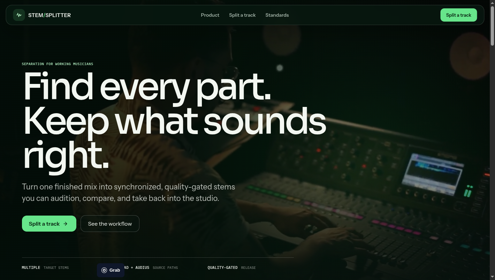
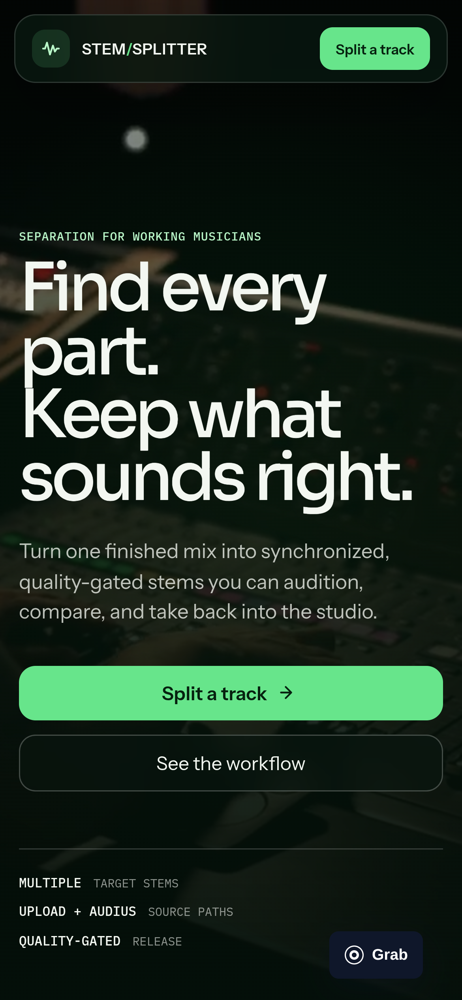
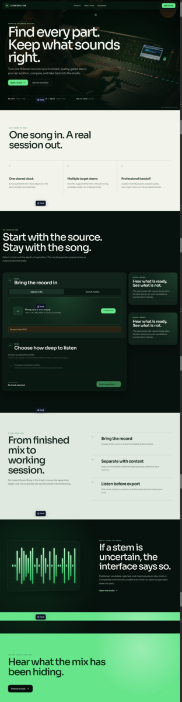

# StemSplitter design system

This document defines the visual and interaction system for the musician-facing
StemSplitter product. It translates the product blueprint and the
[competitive teardown](./competitive-ui-teardown.md) into one implementation
contract for Figma and React.

## Decision status

The previous backstage-editorial direction is rejected. Its `93/100` score is
withdrawn because the rubric measured internal completeness without proving
that the design met the established audio-workspace paradigm.

The V2 spatial-glass presentation layer is also rejected after direct review
against the live Moises desktop and mobile experiences. It retained too much
dark canvas, lacked human media and surface contrast, and made its shadows and
glass visually ineffective. Its waveform, transport, metadata, and responsive
behavior remain valid functional scaffolding.

The final V3 direction is **emerald signal studio**: a cinematic musician entry,
warm editorial explanation, and a focused green-black audio workspace. Read the
[Moises UI and UX case study](./moises-ui-ux-case-study.md) and the
[public platform case studies](./public-platform-ui-case-studies.md) before
changing tokens, Figma screens, or frontend presentation. Moises owns workspace
structure, Suno owns entry atmosphere, BandLab owns public product proof and
mobile recomposition, Fadr contributes direct waveform manipulation, and LANDR
contributes professional trust and handoff. V3 translates those responsibilities
into one StemSplitter system rather than reproducing any competitor palette.

The V3 web implementation is the current rendered reference. It demonstrates
full-bleed musician media, ivory and sage reading surfaces, forest-black studio
surfaces, mineral-green actions, perceptible depth, and selective glass. Figma
must reproduce these rules on new V3 pages before it is treated as the visual
source of truth.

The canonical design file remains
[StemSplitter in Figma](https://www.figma.com/design/QsLAJ4yc2UB3HvUQdXsVyw).
The redesign must use new V3 pages so rejected V1 and V2 work cannot be
mistaken for the current source of truth.

The remaining sections are the V3 implementation contract.

### Rendered V3 evidence







## Product boundary

The current release supports one separation journey with two input paths.

- local audio upload;
- eligible Audius search and import;
- public profile selection;
- upload, queue, processing, cancellation, recovery, and completion;
- honest target, candidate, rejected, and missing-stem status;
- synchronized auditioning of published audio artifacts;
- individual and bundle downloads.

Accounts, billing, collaboration, a persistent project library, remix editing,
practice tools, and DAW handoff remain product-roadmap capabilities. They must
not appear as working controls in the current release.

## Design thesis

StemSplitter should feel like a modern audio workstation reduced to the exact
decisions needed after separation. Sound is the content. The waveform is the
organizing object. Controls float above the content only when they need to stay
available.

The product borrows the category grammar users already understand from Moises,
Fadr, BandLab, and DAWs:

- one project context;
- one timeline;
- one playhead;
- one transport authority;
- one channel row per stem;
- mute, solo, level, and quality state beside every channel;
- export in a stable top-right location.

StemSplitter differentiates through clearer stem hierarchy, visible quality
truth, partial-result handling, self-hosted support, and a restrained glass
control layer.

## Experience model

The journey changes state inside one learned workspace instead of becoming a
long page of unrelated sections.

1. **Import.** Select upload or Audius, choose the outcome, and understand the
   current output contract.
2. **Prepare.** Display source identity and a source waveform preview when it
   can be generated locally.
3. **Process.** Keep source context visible while the job advances through
   upload, queue, inference, and packaging.
4. **Listen.** Open published stems in a synchronized multitrack timeline.
5. **Inspect.** Solo, mute, balance, seek, compare with the original, and review
   quality state.
6. **Export.** Download selected stems or the complete bundle.
7. **Recover.** Preserve source and completed artifacts through reconnect,
   cancellation, partial failure, and retry.

## Page anatomy

### Import room

The first viewport uses full-bleed recording-studio video beneath a deep emerald
grade. It contains compact glass navigation, one concise product promise, one
primary action, one secondary action, and three verified product facts. The
video has a static poster fallback and disappears under reduced motion.

A light proof band resets attention before the import room. The dock then
contains upload and Audius tabs, file or track identity, separation profile,
output expectation, and the primary action. Product qualification is visible
but does not compete with the action.

### Processing workspace

The source waveform and project header remain visible. Channel rows appear as
their outputs become available. The current processing stage occupies a
transient overlay or inspector, not an unrelated full-width status card.

Cancellation, reconnect, retry, and remote-adapter messages state whether the
source and completed work remain safe.

### Listening workspace

Desktop uses four stable regions:

| Region | Responsibility |
| --- | --- |
| Project bar | Source identity, duration, profile, quality status, export |
| Channel rail | Stem label, hierarchy, mute, solo, level, presence, quality |
| Timeline | Time ruler, stacked waveforms, selection, loop, shared playhead |
| Transport | Play, seek, time, original comparison, loop, master level |

An optional inspector provides downloads, model provenance, missing features,
and rejected candidates. Closing it must not affect playback.

## Spatial-glass system

Glass represents the functional layer above audio content. It is not a card
style applied to every surface.

### Regular glass

Use regular glass for navigation, transport, inspectors, menus, and text-heavy
overlays.

```css
background: rgb(8 25 17 / 72%);
backdrop-filter: blur(26px) saturate(125%);
-webkit-backdrop-filter: blur(26px) saturate(125%);
border: 1px solid rgb(255 255 255 / 12%);
box-shadow:
  inset 0 1px rgb(255 255 255 / 8%),
  0 24px 72px rgb(0 0 0 / 30%);
```

### Clear glass

Use clear glass only for compact icon controls over dark artwork or waveform
content. Add adaptive dimming when the background does not provide sufficient
contrast.

### Solid content

Waveform lanes, quality evidence, long text, tables, and form validation use
solid surfaces. Nested glass and blur behind small text are prohibited.

Every material has an opaque fallback for reduced transparency, unsupported
browsers, and performance-constrained devices.

## Color system

The shell uses forest-black rather than flat black. Ivory and sage reading
surfaces create page rhythm; waveform colors identify instruments. Green owns
product action and must not be reused as an arbitrary decorative accent.

| Token | Value | Purpose |
| --- | --- | --- |
| `canvas.base` | `#07110D` | Application and cinematic background |
| `surface.workspace` | `#0B1812` | Waveform content layer |
| `surface.raised` | `#11231A` | Channel rail and solid inspector |
| `surface.control` | `#193126` | Inputs and inactive controls |
| `surface.paper` | `#F2F3EA` | Primary editorial reading surface |
| `surface.sage` | `#DFE9DF` | Workflow and explanatory reset |
| `glass.regular` | `rgb(8 25 17 / 72%)` | Persistent functional layer |
| `glass.clear` | `rgb(255 255 255 / 8%)` | Media-overlay controls |
| `text.primary` | `#F3F7F1` | Primary text on dark surfaces |
| `text.secondary` | `#B4C4B9` | Supporting text on dark surfaces |
| `text.tertiary` | `#778B7E` | Low-emphasis metadata |
| `text.ink` | `#102018` | Text on light and action surfaces |
| `action.primary` | `#67E58B` | Main action and playhead |
| `action.ink` | `#06210F` | High-contrast text on green |
| `focus.ring` | `#B9F6C8` | Keyboard focus |
| `status.success` | `#67E58B` | Completed and published |
| `status.warning` | `#FFC857` | Evaluation and caution |
| `status.danger` | `#FF6B78` | Failure and destructive action |

### Stem palette

Stem color is identity, never quality.

| Family | Color | Includes |
| --- | --- | --- |
| Source | `#CBD5E1` | Original and instrumental parent |
| Voice | `#FF6F91` | Vocals and vocal descendants |
| Rhythm | `#FFB84D` | Drums, kick, snare, percussion |
| Bass | `#42D3E8` | Bass and low-frequency descendants |
| Keys | `#73A2FF` | Piano and keys |
| Guitar | `#61D9A6` | Acoustic and electric guitar |
| Synth | `#F08BC3` | Synth and electronic textures |
| Ensemble | `#55D6C2` | Strings, wind, and brass |

Selected channels increase luminance and waveform weight. Muted channels lower
opacity but retain their label. Solo state uses an icon, text, and channel
isolation, not a new instrument color.

## Typography

The interface uses typography that belongs in a modern creative tool rather
than an editorial campaign.

- **Display:** Sora Medium and Semibold.
- **Interface:** Instrument Sans Regular, Medium, and Semibold.
- **Timecode and technical data:** IBM Plex Mono.
- **Fallback:** a documented sans-serif or monospace fallback only after the
  authored fonts.

Project titles use compact display sizing. Controls use sentence case and
remain at least `13px`. Timecode, BPM, key, sample rate, and technical IDs use
the mono face. Oversized all-caps labels and irregular editorial headlines are
not part of the workspace language.

## Layout and density

The system uses a 4-pixel atomic scale and an 8-pixel primary rhythm.

| Token | Value | Use |
| --- | --- | --- |
| `space.1` | `4px` | Optical correction |
| `space.2` | `8px` | Compact control gap |
| `space.3` | `12px` | Channel-control padding |
| `space.4` | `16px` | Default component gap |
| `space.6` | `24px` | Panel padding |
| `space.8` | `32px` | Major region gap |
| `space.12` | `48px` | Import-room section gap |

Desktop channel rows target `72px` to `88px` high. The transport targets
`64px`. Dense controls use `8px` to `12px` radii; glass groups use `18px` to
`24px`. Repeating a large radius on every container is prohibited.

## Waveform language

Waveforms are functional data visualizations.

- Every published audio stem receives a real peak envelope.
- All lanes share one time scale and playhead.
- Played and unplayed regions remain visually distinct.
- Muted waveforms retain structure at reduced opacity.
- Selected waveforms receive a subtle glow and stronger fill, not an animated
  decorative equalizer.
- Parent and child stems use indentation and channel grouping.
- Partial or rejected stems use an explicit lane state instead of an invented
  waveform.
- Zoom changes the time scale for every lane together.

The source waveform appears above or within the group hierarchy and supports a
single-action original comparison.

## Control model

### Channel controls

Every audible stem has a label, color marker, mute, solo, level, and quality
status. Pan and advanced metadata can live in an inspector until the product
supports them completely.

### Transport

The transport is persistent and authoritative. It owns play, pause, current
time, duration, seek, loop, source comparison, and master output. Independent
audio players are prohibited.

### Export

Export remains in the project bar. The export panel distinguishes published
main stems, broad stems, specialist candidates, analysis, MIDI, tempo-locked
WAVs, and bundles without flattening them into one list.

## Responsive behavior

### Tablet

The channel rail narrows, secondary metadata moves into the inspector, and the
transport remains full width. The waveform timeline keeps horizontal zoom and
does not collapse into individual players.

### Mobile

Mobile retains one master waveform and a vertical channel mixer. Each channel
shows a compact waveform strip, mute, solo, and level. Selecting a channel
opens a glass bottom sheet with details and downloads. A compact glass transport
stays above the safe area.

Mobile cannot become a generic list of cards. The current time, play state,
active channel, and export action remain visible.

## Motion

Motion explains audio and workspace continuity.

- The playhead and meters move only from real playback data.
- Waveform lanes reveal progressively as peak data arrives.
- Direct controls respond within `120ms`.
- Glass panels enter within `180ms` to `240ms`.
- Workspace transitions remain below `360ms`.
- Reduced-motion mode removes panel travel and decorative blur animation.

Ambient moving gradients, fake equalizers, pulsing cards, and routine success
celebrations are prohibited.

## State inventory

The Figma source must cover these states before implementation.

| Surface | Required states |
| --- | --- |
| Import | empty, drag, selected, invalid, too large, uploading, failed |
| Audius | empty, searching, results, no result, ineligible, provider failure |
| Profile | loading, selected, unavailable, evaluation explanation |
| Project | preparing, queued, processing, packaging, reconnecting |
| Channel | pending, available, playing, muted, soloed, rejected, missing |
| Transport | idle, playing, seeking, looping, source comparison, audio failure |
| Result | partial, completed, expired, bundle unavailable |
| Recovery | cancelling, cancelled, retrying, recoverable, terminal |
| Export | closed, selecting, downloading, complete, failed |

## Accessibility

Critical journeys target WCAG 2.2 Level AA.

- All transport and channel controls work with keyboard alone.
- Focus remains visible over solid and glass surfaces.
- Controls target at least `44px` on touch surfaces.
- Stem identity never relies on color alone.
- Waveforms provide text alternatives for duration, channel, and playback
  state.
- Live regions announce upload, job, channel availability, and terminal state
  without announcing continuous time updates.
- Reduced transparency replaces glass with an opaque solid surface.
- Increased contrast strengthens material opacity, borders, and focus.
- Zoom and reflow preserve the transport and primary action.

## Waveform implementation contract

The packaging stage creates a compact, versioned peak-envelope analysis
artifact for the source and every published audio stem. The frontend draws the
timeline from peaks and streams only audible audio.

One audio clock owns transport time. Mute, solo, level, seeking, loop changes,
and source comparison update the synchronized graph. Loading eleven unrelated
audio elements and attempting to keep them aligned is prohibited.

## Revised design gate

The Figma redesign requires at least `90/100`, but the total score cannot hide
a category failure.

| Category | Weight | Minimum |
| --- | ---: | ---: |
| Category-paradigm fit | 20 | 17 |
| Musician task clarity | 15 | 13 |
| Waveform and transport interaction | 20 | 17 |
| Visual system and glass restraint | 15 | 12 |
| State and recovery coverage | 10 | 8 |
| Responsive continuity | 10 | 8 |
| Accessibility and feasibility | 10 | 9 |

The review compares matching StemSplitter frames directly with current Moises,
Fadr, and BandLab references. A design fails regardless of score when it uses
independent result players, omits synchronized waveforms, hides evaluation
truth, overuses glass, or loses transport authority on mobile.

## Acceptance test

The design is ready for implementation only when all statements are true.

- A musician identifies the song, current time, audible stems, and export
  action in five seconds.
- The shared playhead and synchronized channel relationship need no
  explanation.
- Import, processing, partial result, completion, and recovery feel like states
  of one product.
- Stem hierarchy, quality, and availability remain distinct concepts.
- Glass distinguishes controls from content without reducing legibility.
- Desktop, tablet, and mobile preserve one transport model.
- The design uses actual current product capabilities or marks architectural
  requirements explicitly.
- A competitor-anchored review and an unassisted musician task both pass.
