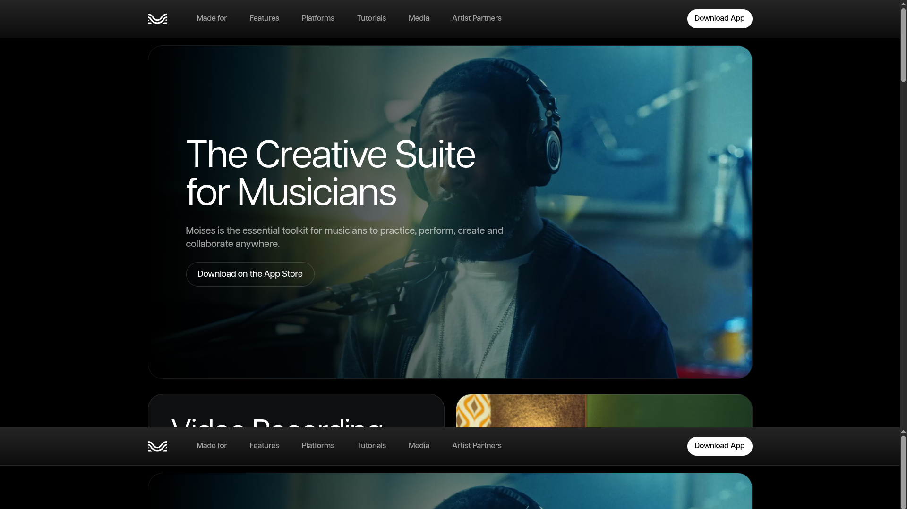
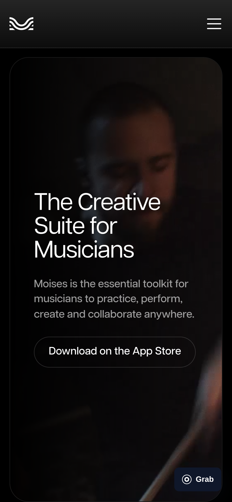
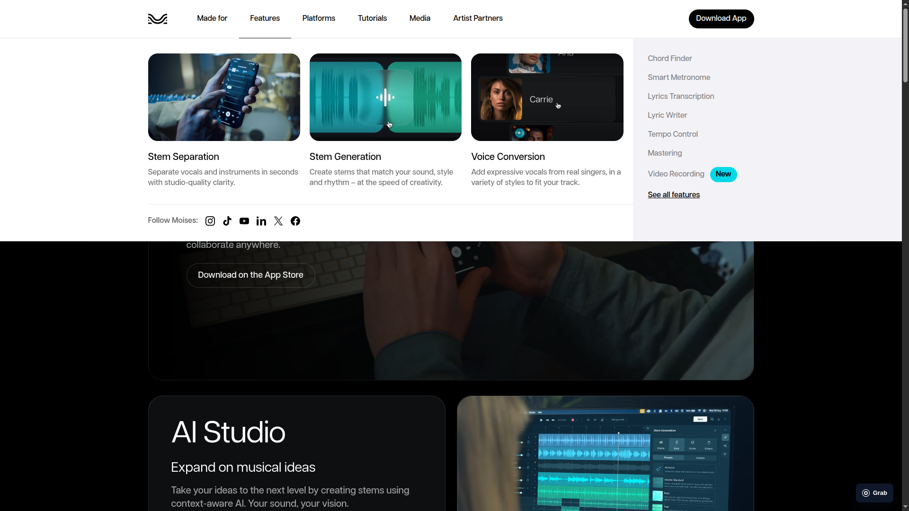
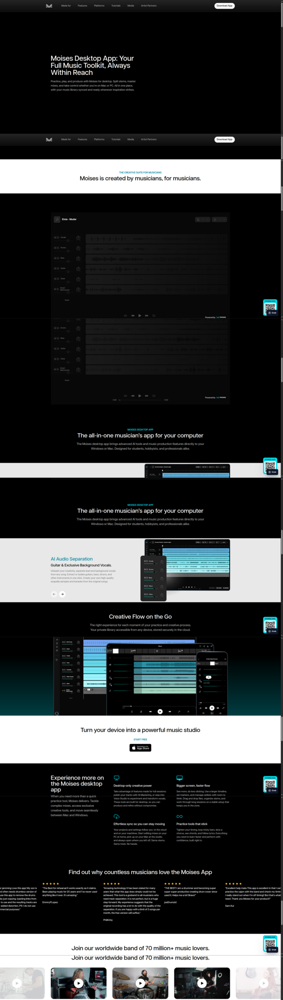
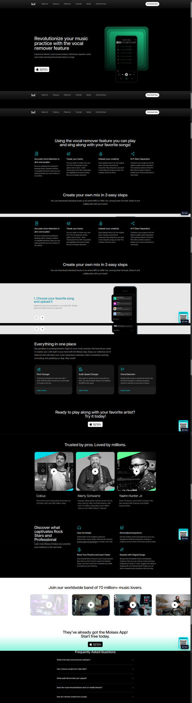

# Moises UI and UX case study

This case study records the visual, interaction, information-architecture, and
responsive patterns observed on the live Moises website on August 4, 2026. It
exists to prevent another redesign based on memory, mood boards, or isolated
screenshots. StemSplitter must use these findings as evidence before defining
its next visual direction.

The goal is not to reproduce Moises branding. The goal is to understand why
its experience feels coherent, credible, and musician-centered, then preserve
that category fluency while expressing StemSplitter's own product truth.

## Research scope

The review used the live desktop and mobile experiences rather than search
result thumbnails. It covered these surfaces:

- the [Moises home page](https://moises.ai/);
- the **Made for**, **Features**, and **Platforms** mega-menus;
- the [vocal remover feature page](https://moises.ai/features/vocal-remover/);
- the [desktop product page](https://moises.ai/products/moises-desktop-app/);
- the Moises Studio login experience;
- the web, desktop, tablet, and mobile product images published by Moises.

Measurements came from the rendered accessibility and layout trees at a
`1905px` desktop content width and a `390px` mobile viewport. Values can change
as Moises updates its site, so treat them as a coherent system rather than a
pixel-copy specification.

## Visual evidence

These screenshots were captured from the live Moises website on August 5,
2026. They are research evidence, not StemSplitter assets and not approved for
reuse in the product.

### Desktop home page

The first viewport uses musician video as the canvas, a restrained navigation
bar, one cyan action, one outlined action, and large rounded media geometry.

Source: [Moises home page](https://moises.ai/).

### Mobile home page

The mobile composition preserves the media-led hero, reduces the headline to
`40px`, uses `16px` outer margins, and stacks the two actions.

Source: [Moises home page](https://moises.ai/).

### Features mega-menu

Opening **Features** replaces the dark navigation environment with a light
mega-menu. Three photographic priority cards explain product pillars while a
pale secondary column lists supporting tools.

Source: [Moises home page](https://moises.ai/).

### Desktop product narrative

The desktop product page alternates black, white, and soft-gray sections. Large
application screenshots provide evidence for cross-device continuity and the
multitrack workspace.

Source: [Moises desktop product page](https://moises.ai/products/moises-desktop-app/).

### Stem-separation feature narrative

The vocal-remover page demonstrates the same surface rhythm at feature level:
dark product explanation, white process sections, dark proof sections, and a
cyan conversion band.

Source: [Moises vocal-remover page](https://moises.ai/features/vocal-remover/).

## Executive correction

Moises does use black as a foundation, but it does not present an uninterrupted
black application. Its design continually changes the material behind the
content:

- cinematic musician video and photography interrupt the black canvas;
- charcoal cards create visible grouping;
- white and soft-gray sections reset attention;
- cyan ambient fields and transition bands create atmosphere;
- product screenshots provide dense visual proof;
- translucent control surfaces sit inside media rather than covering every
  content block;
- light mega-menus create a strong contrast change during navigation.

StemSplitter V2 copied the darkness without reproducing this surface rhythm,
media density, or product proof. The result is technically styled but visually
flat. Declaring a CSS shadow or backdrop blur does not create perceived depth
when the foreground and background have nearly identical luminance.

## Product and information architecture

Moises organizes the product through three musician-centered questions instead
of exposing its internal feature inventory.

### Who is it for?

The **Made for** menu leads with photographic cards for guitarists, drummers,
and producers. A secondary list covers vocalists, bassists, keyboardists,
worship leaders, DJs, and educators. Every role is described through an
outcome, such as learning a part, creating a clean cover, or extracting stems.

This makes the product legible before a visitor understands the technology.
StemSplitter currently speaks first about targets, source paths, quality gates,
and shared clocks. Those concepts belong in the product workspace or technical
documentation, not at the top of the musician's entry experience.

### What can it do?

The **Features** menu gives visual priority to three strategic capabilities:
stem separation, stem generation, and voice conversion. It places supporting
tools such as chord finding, metronome, lyrics, tempo control, mastering, and
video recording in a quieter list.

The hierarchy separates product pillars from utilities. It avoids giving every
feature an equally prominent card.

### Where can it be used?

The **Platforms** menu shows mobile, desktop and web, and live use as visual
cards. iPad, VST, and DAW integrations sit in the secondary list. Product
screenshots demonstrate continuity across devices instead of relying on text
claims.

StemSplitter can adopt the same information principle without pretending that
future platforms already exist: lead with the working web splitter, then label
self-hosting and future DAW or desktop paths honestly.

## Visual system

The visual system is restrained, but it is not sparse. Large media, controlled
contrast shifts, and consistent geometry do most of the work.

### Surface choreography

The live pages use these recurring surface roles:

| Surface | Observed value | Role |
| --- | --- | --- |
| Cinematic canvas | `#000000` | Frames photography, video, and product UI |
| Dark card | approximately `#0E0F11` | Groups feature copy and controls |
| Product neutral | approximately `#262E36` | Holds cross-device product imagery |
| Soft gray | approximately `#E8E8E8` | Creates a calm product-explanation reset |
| Light canvas | `#FFFFFF` | Supports statements, conversion, and menus |
| Cyan action | approximately `#00DAE8` | Marks primary actions and brand moments |
| Cyan dark text | approximately `#001316` | Maintains contrast on cyan actions |

The important pattern is alternation, not any individual hexadecimal value.
On the desktop product page, black hero and product-proof sections alternate
with white statements, a soft-gray feature carousel, another black device
showcase, and a white conversion band. The feature page uses white process and
community bands between black sections, then ends with a cyan-lit transition.

### Typography

Moises uses Articulat as its primary rendered typeface. The type is neutral,
wide, and modern rather than decorative.

| Context | Desktop | Mobile | Weight |
| --- | --- | --- | --- |
| Home hero | `80px` | `40px` | Regular |
| Major section heading | `64px` to `80px` | `40px` | Regular |
| Standard product heading | `40px` | approximately `32px` to `40px` | Regular |
| Supporting copy | `20px` | `18px` | Regular |
| Navigation | `16px` | `18px` in the menu | Regular |
| Primary action | `18px` | `18px` | Medium |

Headlines use compact line height and sentence case. The site does not depend
on tiny uppercase technical labels to create hierarchy. Supporting text often
uses white at roughly `60%` opacity, while major claims remain fully opaque.

### Spacing and geometry

The desktop site uses a `1280px` primary content region inside a wider shell.
Observed horizontal shell padding is approximately `128px` on large screens.
Major sections commonly use `40px`, `64px`, or `80px` vertical spacing.

The geometry follows a small set of repeated rules:

- `80px` navigation height;
- `52px` primary and secondary actions;
- `24px` to `32px` major panel radii;
- `20px` inner control radii;
- `8px` action gaps;
- `24px` card gaps;
- generous media blocks instead of many small dashboard cards.

Large radii work because they belong to substantial media and feature panels.
They are not repeated on every label, row, and technical status.

### Color behavior

Cyan is scarce and therefore meaningful. It appears on the primary CTA,
selected product details, eyebrow copy, badges, waveform content, and ambient
light. White handles conversion actions on dark surfaces. Black handles actions
on light surfaces.

Moises does not assign many unrelated accent colors to its interface chrome.
The music content, artwork, and waveform supply secondary color.

### Shadows and depth

Moises creates depth through composition before effects:

1. Place a media or product layer above a contrasting canvas.
2. Use a visible tonal step between canvas, card, and control.
3. Add a restrained border or inner highlight.
4. Use a soft shadow only where a floating control, menu, or foreground device
   needs separation.

The light mega-menu demonstrates this clearly. It floats above the dark page,
uses white and pale-gray columns, and lets card photography supply depth. The
site does not apply a heavy shadow to every dark card because shadows disappear
on black.

### Glass and translucency

Moises is not primarily a glassmorphism product. Its public pages rely more on
solid surfaces, media overlays, and partial transparency than on strong
background blur. Observed translucent treatments include:

- a dark `80%` control panel around the waveform demonstration;
- white overlays near `5%` for mixer channels;
- white overlays near `10%` for compact controls;
- a black `40%` text scrim over testimonial photography;
- dark translucent play pills over community media.

This distinction matters. StemSplitter can add selective glass as its own
signature, but it must use glass over meaningful media, waveform, or ambient
content. A translucent navy rectangle over another navy rectangle reads as a
flat card, not glass.

## Page composition

The home page follows a deliberate proof sequence.

1. **Establish the audience.** A musician video carries the hero, promise, and
   two actions.
2. **Reveal the suite.** Large paired panels explain one capability at a time.
3. **Prove continuity.** Desktop, tablet, and mobile screenshots share one
   stage.
4. **Make the product tangible.** An interactive waveform and mixer demo lets
   the visitor understand the core action.
5. **Establish scale.** A large artist count creates a clear trust break.
6. **Use artist testimony.** Full-width photography connects product utility to
   a working musician.
7. **Show recognition.** Awards and platform proof reduce perceived risk.
8. **Show the community.** Creator cards make the audience visible.
9. **Resolve objections.** FAQs precede the dense footer.

The page does not begin with an abstract technical dashboard. It moves from
emotion to product proof, then to trust and conversion.

## Product workspace grammar

Published Moises product images show a consistent audio workspace:

- a narrow left navigation and project rail;
- a compact project header with actions at the top;
- stacked waveform lanes as the dominant visual object;
- one shared timeline and playhead;
- channel controls aligned beside each stem;
- persistent transport below the timeline;
- cyan waveform content against dark neutral lanes;
- dense controls revealed progressively rather than displayed in the entry
  experience.

The workspace itself uses solid dark surfaces more than decorative glass. The
waveforms and project content provide the visual energy. This confirms that
StemSplitter's synchronized transport and waveform architecture are correct,
while its entry presentation and material hierarchy need redesign.

## Navigation behavior

The navigation is a meaningful part of the visual system.

- Desktop uses an `80px` bar with low-emphasis labels and separate login and
  sign-up actions.
- Opening a mega-menu changes the navigation environment from dark to light.
- Each mega-menu uses three photographic priority cards and a pale secondary
  list.
- Social links live at the bottom of the menu rather than competing with the
  main navigation.
- Mobile replaces the links with a large menu control and a full-height menu.

The contrast change communicates that the visitor has entered a navigation
mode. StemSplitter's current header remains one low-contrast strip and offers
no comparable state change or hierarchy.

## Responsive behavior

At `390px`, Moises preserves the same story rather than shrinking the desktop
composition.

- Outer margins become `16px`.
- The hero becomes a `358px` wide, `748px` tall media panel.
- The headline drops from `80px` to `40px`.
- Supporting copy drops from `20px` to `18px`.
- Actions stack vertically while retaining their `52px` height.
- Two-column feature panels become one-column carousels.
- The cross-device stage becomes a compact visual composition.
- Mixer channels collapse from two columns to one.
- Testimonial copy gains a bottom scrim over the photograph.
- Carousel navigation remains reachable near the lower edge of each module.

Mobile is intentionally recomposed. It is not a desktop grid with hidden
columns.

## Current StemSplitter gap analysis

The current entry screen fails for specific, observable reasons.

| Current behavior | Why it feels weak | Required correction |
| --- | --- | --- |
| Deep blue-black covers nearly the entire viewport | No material or emotional rhythm | Alternate light, gray, media, and dark work surfaces |
| Oversized abstract headline dominates the page | Reads like a generated SaaS hero, not a musician tool | Lead with a musician outcome and visible product action |
| Technical counters appear before a user selects audio | Exposes implementation concepts without helping the task | Move quality and system truth into contextual workspace states |
| Import controls begin below the fold | Delays the reason the visitor arrived | Make import the primary first-viewport action |
| No musician photography or moving image is present | The product has no human or cultural signal | Use licensed or original musician media with purposeful art direction |
| Most surfaces share similar navy luminance | Borders and shadows cannot create depth | Increase tonal separation and place shadows against lighter boundaries |
| Blue is used as the main action color | Feels like generic developer tooling | Use a controlled cyan action system and let stems provide other colors |
| Glass is declared but visually imperceptible | Blur has no content to refract | Place glass only over media, waveform, or a visible atmospheric field |
| Every concept receives a panel or label | Produces dashboard density before the task begins | Prioritize one action, then disclose secondary information progressively |

## V3 foundation

The next direction is a Moises-derived hybrid, not another dark-theme variant.
It must preserve the working audio architecture while replacing the rejected
presentation layer.

### Entry environment

Use a warm light or soft-gray application canvas with a dark cinematic media
stage. Put the import action inside the first viewport. Real musician media or
a product waveform demonstration must carry the atmosphere. Use cyan for the
single primary action and black or white for secondary actions according to the
surface beneath them.

### Workspace environment

Use a dark, compact audio workspace once a song is processing or ready. Keep
stacked waveform lanes, the shared playhead, channel controls, and transport.
Create clear tonal steps between canvas, channel rail, waveform lanes, and the
inspector. Stem colors belong to waveforms, not general interface chrome.

### Glass signature

Use glass for the top navigation, floating transport, menus, and the mobile
inspector only. The material needs visible content underneath, a one-pixel
highlight, controlled blur, and a broad shadow. Waveform lanes, forms, long
copy, and quality evidence remain solid.

### Depth signature

Use three depth levels only:

- **Level 0:** page canvas and waveform field;
- **Level 1:** solid media, import, channel, and inspector surfaces;
- **Level 2:** glass navigation, menus, transport, and transient overlays.

Every level must remain distinguishable in grayscale. If removing color makes
two adjacent levels merge, the depth treatment has failed.

## Design acceptance gate

No V3 implementation can begin until the Figma review proves all of these
conditions.

- The entry screen contains at least two clearly different surface
  environments without becoming a checkerboard.
- Import is visible and understandable in the first viewport.
- Human musician media or a real product demonstration supplies visual
  atmosphere.
- Shadows remain visible at normal brightness and in grayscale.
- Glass visibly refracts media, waveform, or ambient content underneath it.
- The workspace still behaves as one synchronized audio project.
- Desktop and mobile are separately composed.
- Technical quality language appears only where it helps a decision.
- The design works without claiming unbuilt product features.
- A side-by-side review against the live Moises reference identifies both the
  borrowed category grammar and StemSplitter's intentional differences.

## What we retain from V2

The visual layer is rejected, but the following product engineering remains
valid:

- backend-generated waveform peak data;
- synchronized multi-stem transport;
- mute, solo, level, and seeking behavior;
- typed artifact and quality metadata;
- responsive channel inspector behavior;
- honest missing, rejected, and partial-result states.

The next design must improve presentation without discarding these working
contracts.

## Next steps

Translate this case study into a revised token and component specification.
Then create a new V3 Figma direction for the entry and completed-workspace
states at desktop and mobile sizes. Do not modify the React presentation layer
until that design passes the acceptance gate above.
