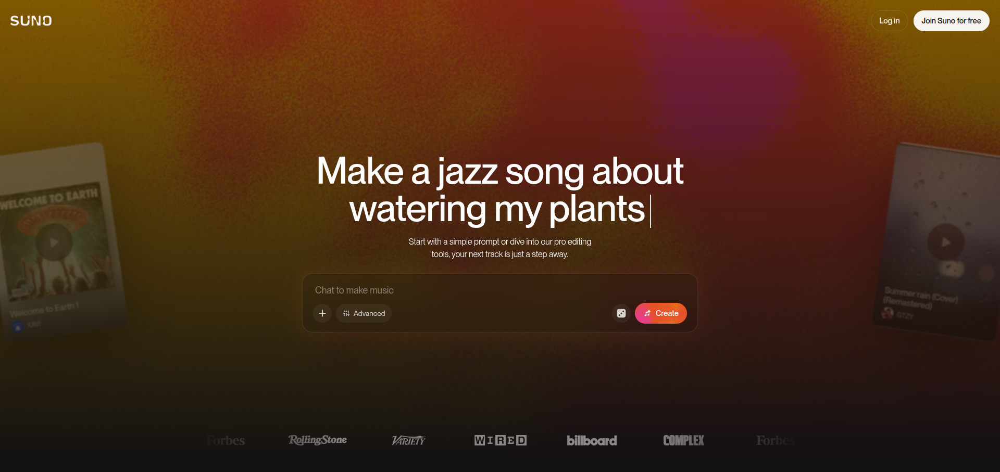
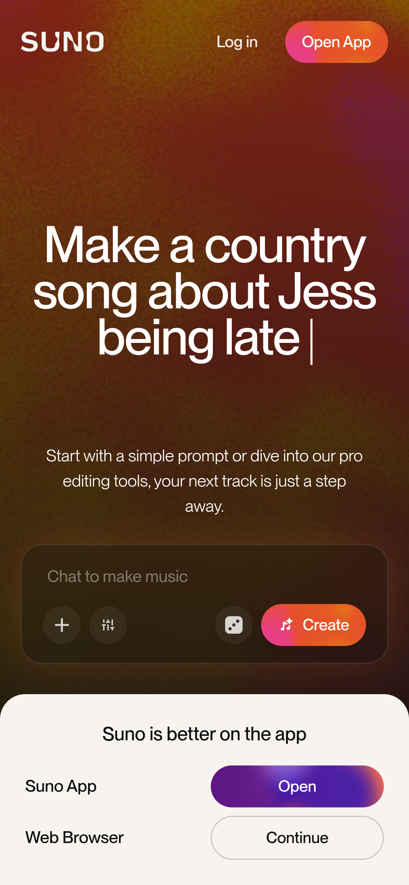
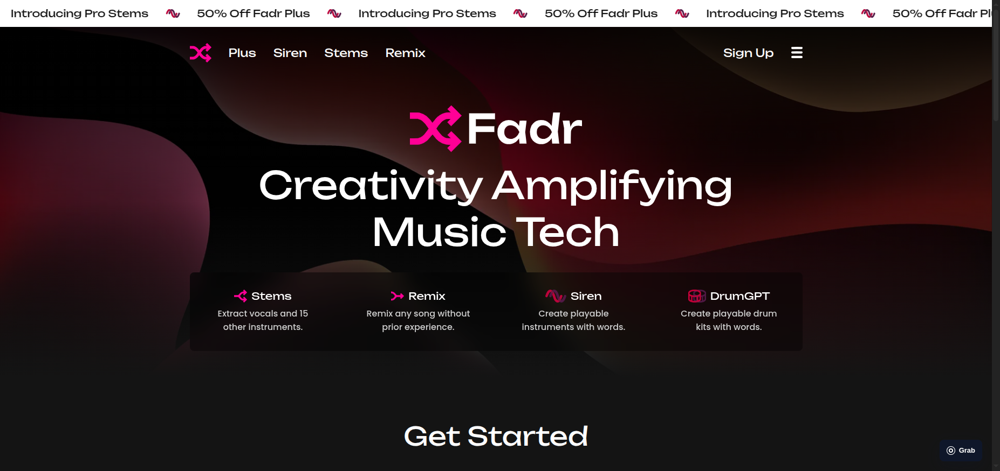
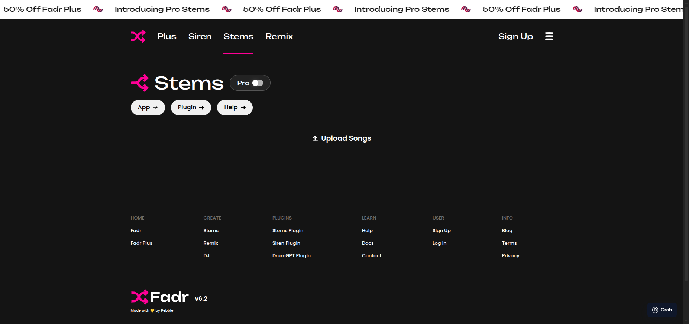
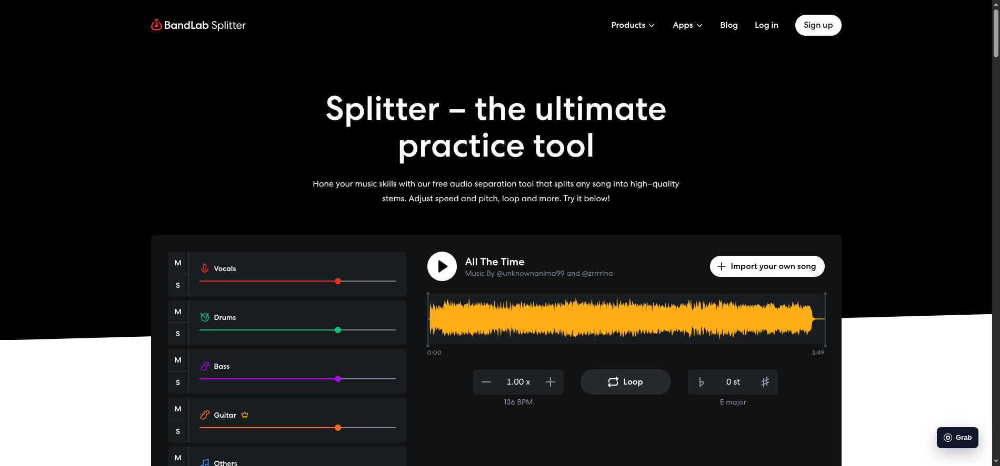
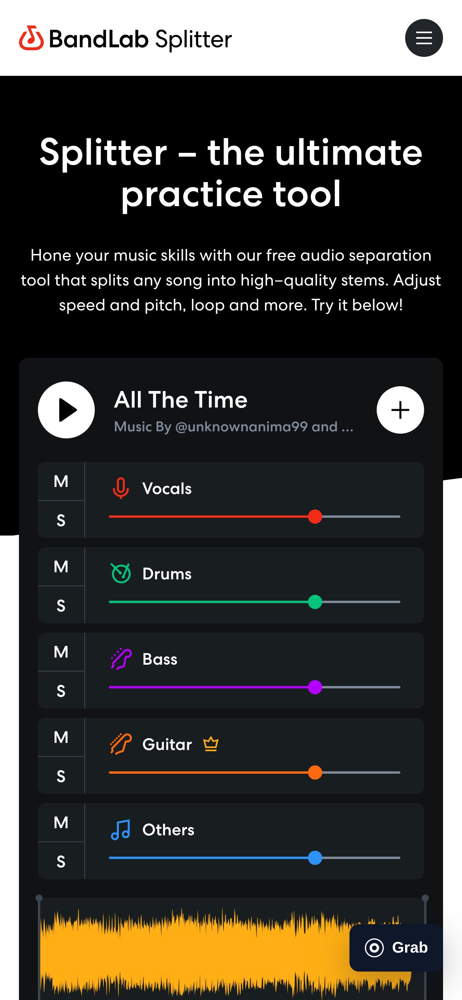
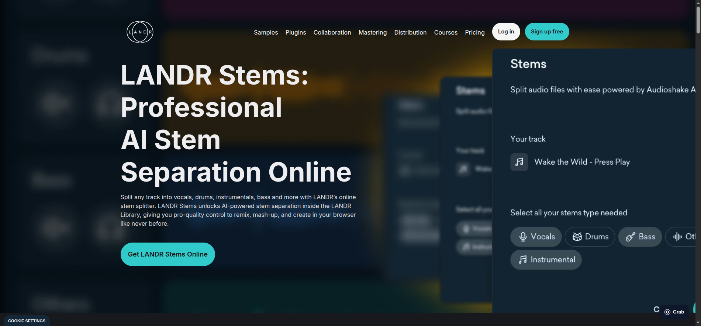
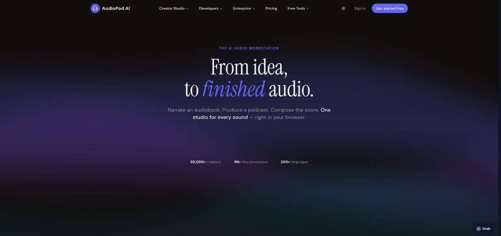
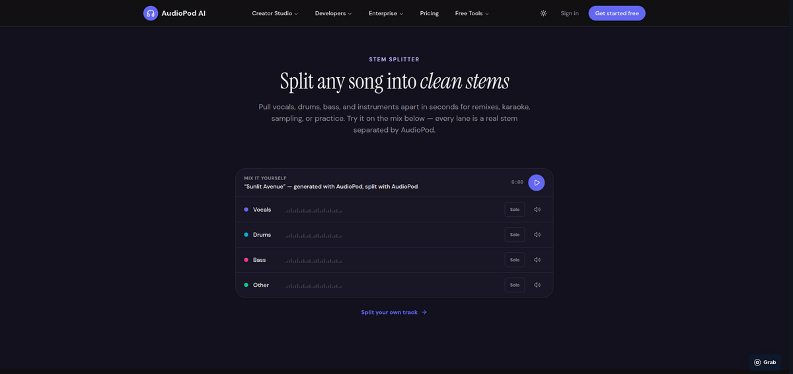
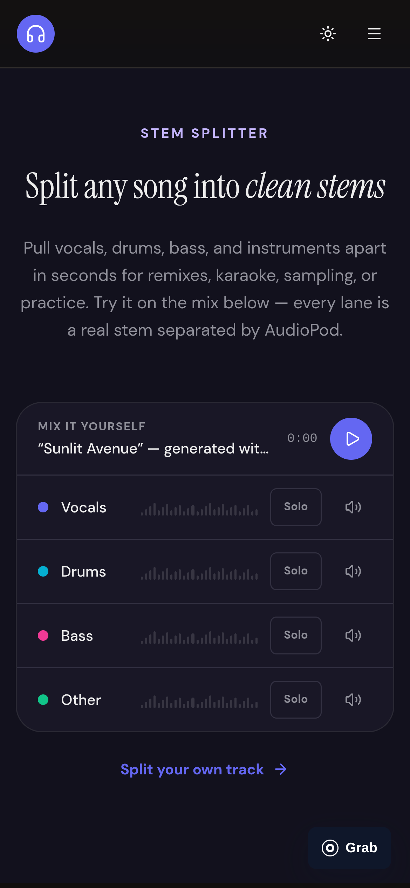

# Public platform UI case studies

This document records direct inspection of public, unauthenticated product and
marketing surfaces in August 2026. It extends the measured
[Moises case study](./moises-ui-ux-case-study.md) with Suno, Fadr, BandLab,
LANDR, and AudioPod. It is evidence for the V3 direction, not permission to
combine every competitor pattern into one interface.

## Research boundary

- Only pages available without an account were evaluated.
- Desktop and mobile behavior were captured where the public page exposed it.
- A visible marketing mockup is not treated as proof of working interaction.
- Product claims are recorded as claims, not independent quality validation.
- The screenshots are time-stamped evidence. Live sites may change later.

## Executive decision

StemSplitter V3 will use one contributor for each design responsibility:

| Responsibility | Primary reference | Why |
| --- | --- | --- |
| Information architecture and workspace calm | Moises | The clearest hierarchy from import through multitrack work |
| Entry atmosphere and input focus | Suno | The task begins inside one expressive, high-emphasis input surface |
| Product proof and responsive mixer behavior | BandLab | The public page demonstrates a real splitter and deliberately recomposes it on mobile |
| Direct waveform manipulation | Fadr | The strongest lesson is audio-first manipulation, not its marketing composition |
| Professional trust and conversion | LANDR | Credibility, ecosystem context, and the next professional action stay visible |
| Playable product evidence | AudioPod | Real output demos make capability legible before signup or upload |

The final result is an **emerald signal studio**. The entry experience is human,
musical, media-rich, and graded through StemSplitter green. Processing and
listening move into a calm, forest-black waveform workspace. Glass is a
selective control material, not the background of every card.

## Suno

Reviewed surface: [Suno home](https://suno.com/)

### Observed system

- A deep neutral shell supports a warm red, orange, and magenta media field.
- The composer is the hero. The large translucent input contains the task and
  its primary action instead of sitting below a generic SaaS headline.
- One pink-to-orange action gradient receives almost all interactive emphasis.
- Compact navigation leaves most of the first viewport to creation.
- Mobile offers an explicit app-or-browser choice instead of assuming that
  desktop composition can simply shrink.
- Glass is readable because it floats over meaningful media with sufficient
  contrast. It is not an invisible blur over another flat dark surface.

### What V3 should borrow

- Make source selection and upload the visual center of the first viewport.
- Use warm musician media or artwork to establish emotion before the technical
  workspace begins.
- Keep one dominant action per state.
- Give mobile a purposeful entry flow rather than a compressed desktop form.

### What V3 should reject

- A creation-prompt metaphor that implies StemSplitter generates music.
- Saturated gradients across routine controls inside the listening workspace.
- Full-screen darkness without the warm media field that makes Suno's surface
  effective.

## Fadr

Reviewed surfaces: [Fadr home](https://fadr.com/) and
[Fadr Stems](https://fadr.com/stems)

### Observed system

- The public home uses a dark charcoal canvas, abstract red-black hero media,
  hot-pink product accents, and a prominent rotating promotion strip.
- Product families are grouped in a broad low-elevation panel rather than a
  sequence of heavily elevated glass cards.
- The unauthenticated Stems route is intentionally sparse: profile controls,
  upload action, help paths, and little simulated product chrome.
- The public surface does not prove the complete mixer interaction. Fadr's
  useful category contribution remains waveform-centered, direct audio
  manipulation documented by its product material.

### What V3 should borrow

- Treat waveforms as editable musical material, not decorative thumbnails.
- Publish available outputs progressively and preserve stem identity.
- Keep product entry direct; do not force a marketing tour before upload.

### What V3 should reject

- The promotion strip and hot-pink visual language as StemSplitter's brand
  foundation.
- Large low-information dark regions.
- Marketing screenshots as evidence that a control is implemented.

## BandLab

Reviewed surface: [BandLab Splitter](https://www.bandlab.com/splitter)

### Observed system

- The first viewport embeds a functioning product demonstration instead of
  asking users to trust feature copy alone.
- A compact two-column stage places channel controls beside a shared waveform,
  project context, speed, loop, and pitch controls.
- Channels use stable instrument colors while the shared waveform receives a
  separate high-contrast yellow treatment.
- Mobile deliberately reorders project identity, stacked channels, and the
  waveform. Mute, solo, level, and transport remain explicit and touchable.
- The longer page alternates black product areas, white explanation, colorful
  practice content, testimonials, FAQ, and conversion. Surface contrast creates
  pacing without excessive card decoration.

### What V3 should borrow

- Put a truthful interactive sample or immediately usable import stage on the
  public page.
- Preserve channel actions on mobile while changing their arrangement.
- Use a single shared timeline and playhead for all stems.
- Alternate light, media, and dark sections to create visible depth and rhythm.

### What V3 should reject

- Practice features that are not part of the current product contract.
- A rainbow of unrelated brand accents in global navigation and actions.
- Any demo whose controls do not operate on real audio.

## LANDR

Reviewed surfaces: [LANDR home](https://www.landr.com/),
[online mastering](https://www.landr.com/online-audio-mastering), and
[online stem splitter](https://www.landr.com/online-stem-splitter)

### Observed system

- LANDR leads with professional outcomes, ecosystem navigation, and trust.
- Dark photographic or product-media heroes carry large white headlines and a
  single cyan action.
- The stem-splitter hero presents a large, legible product mockup beside the
  value proposition. It explains the workflow but does not prove that the
  mockup is interactive.
- The mastering page adds third-party credibility, recognizable customer
  context, workflow explanation, FAQ, and repeated conversion opportunities.
- Mobile collapses navigation and centers the proposition and action, but the
  long headline consumes much of the initial viewport.

### What V3 should borrow

- Put trust, privacy, supported formats, output truth, and professional handoff
  close to the decision to upload.
- Explain the next professional action: audition, export, download, or continue
  in a DAW.
- Use proof and workflow evidence instead of unsupported quality superlatives.
- Keep one stable action color and a restrained navigation shell.

### What V3 should reject

- A headline so tall on mobile that the product action falls below the fold.
- A broad ecosystem navigation before StemSplitter has that ecosystem.
- Decorative product mockups presented as if they were live controls.

## AudioPod

Reviewed surface: [AudioPod home](https://audiopod.ai/)

### Observed system

- AudioPod uses strong serif and sans-serif contrast to make a mostly dark,
  low-effect page feel authored rather than empty.
- Capability sections lead with playable product output. The stem splitter
  presents one song, one transport, and four synchronized lanes instead of a
  screenshot or a feature-card grid.
- Each demo explains what produced the sample and follows it with one relevant
  action.
- Mobile preserves the complete demonstration. It enlarges controls and stacks
  the copy without hiding the stem lanes.
- Long product breadth is manageable because each section repeats a clear
  proof pattern: outcome, real sample, interaction, and next action.

### What V3 should borrow

- Let visitors hear successful output before requiring an upload or a live API
  connection.
- Use one synchronized session as proof instead of several small feature cards.
- Keep demo provenance explicit so generated, separated, and reference audio
  cannot be confused.
- Preserve the complete listening model on mobile with touch-sized controls.

### What V3 should reject

- Product breadth that StemSplitter does not currently deliver.
- Unverified counters or performance claims.
- A second accent palette that would weaken the emerald signal system.
- Decorative waveform bars that are presented as playable audio.

## Cross-platform synthesis

### V3 experience sequence

1. **Arrive.** LANDR-like full-bleed musician media, quiet navigation, and one
   action establish the product before any explanation.
2. **Work.** The hero flows directly into a continuous Moises-like studio
   canvas. The real
   upload and Audius dock is the product proof, not a decorative mockup.
3. **Prove.** An AudioPod-like sample session must demonstrate successful,
   synchronized output when the production backend is unavailable.
4. **Understand.** One inset ivory editorial stage explains synchronized
   listening, visible uncertainty, and clean export without numbered steps.
5. **Continue.** An inset studio-media close returns to the musician and offers
   one final action without turning the whole page into a bright CTA band.

### Visual foundation

- Entry canvas: musician media graded through forest and mineral green while
  preserving warm skin and studio-light highlights.
- Reading surfaces: one inset ivory editorial stage. Do not alternate
  full-width light and dark marketing sections.
- Studio canvas: forest-black `#07110D` reserved for waveform work.
- Action color: mineral green `#67E58B` with forest ink `#06210F`, not a
  different competitor color per section.
- Glass: navigation, transport, menus, and compact over-media controls only.
- Solid surfaces: forms, validation, waveform lanes, quality evidence, tables,
  and long text.
- Shape: compact radii for tools; larger radii only for major entry or media
  stages. Do not make every region a pill or oversized card.
- Motion: entry reveal, processing-to-workspace transition, progressive stem
  publication, and playhead movement. Avoid ornamental floating motion.

### Responsive foundation

- Recompose rather than hide: project identity, channels, waveform, transport,
  and export remain available in a new order.
- Keep the primary action and source context in the first mobile viewport.
- Use bottom or sticky transport only when it does not cover channel controls.
- Preserve touch targets of at least 44 by 44 CSS pixels.
- Never rely on hover for quality, provenance, or download access.

## Rejection rules

The V3 review fails immediately if any of these conditions is present:

- The screen looks like a collage of competitor brands rather than one system.
- The entry and workspace are both flat, all-black surfaces.
- Glass is specified where neither blur nor depth is perceptible.
- Independent audio players replace the synchronized timeline.
- A non-working control is shown without an explicit preview label.
- Technical counters or architecture claims appear before the user's task.
- Capability copy presents candidate, missing, or unbenchmarked stems as proven.
- Desktop columns are merely hidden on mobile instead of recomposed.
- More than one primary action competes within a state.
- Human or musical context is absent from the complete public journey.
- Repeated section numbers turn the narrative into a generic process template.
- Decorative waveforms or proof cards imitate product evidence that already
  exists in the live studio.
- A full-width bright conversion band breaks the studio atmosphere.

## V3 acceptance gate

Figma implementation may begin only after a low-fidelity flow proves:

- public entry, upload, Audius import, processing, partial results, listening,
  export, failure, reconnect, and mobile states;
- a truthful interactive or audio-backed product demonstration;
- one synchronized waveform authority and one transport authority;
- a warm media entry, one brief light reset, and a continuous dark studio;
- perceptible shadows and selective glass at desktop and mobile sizes;
- no roadmap-only capability represented as a working feature.

Every high-fidelity change must update the root `DESIGN.md` contract and then
pass accessibility contrast, keyboard, touch-target, reduced-motion,
reduced-transparency, content-truth, and responsive reviews in React and Figma.
