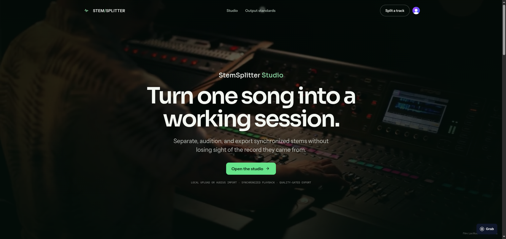
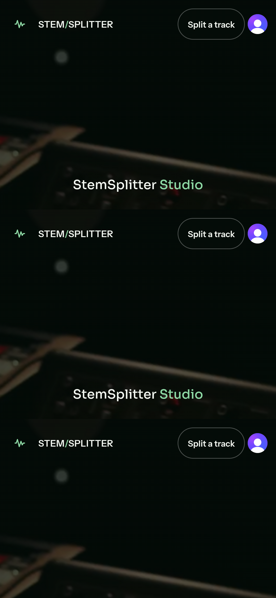

# Vite migration baseline

This document freezes the production web client before its migration to
Next.js App Router. Use these artifacts to detect behavior, visual, API, and
deployment regressions. The baseline represents commit `543e95e` on August 9,
2026.

## Build evidence

The baseline uses Node.js `22.22.2`, npm `11.11.1`, TypeScript `5.8.3`, and
Vite `6.4.3`. The following command completed successfully in `5.46` seconds:

```bash
npm ci
npm run build
```

The production build generated these primary application assets:

| Asset | Raw size | Gzip size |
| --- | ---: | ---: |
| JavaScript | 332.01 kB | 99.45 kB |
| CSS | 36.64 kB | 8.04 kB |
| HTML | 0.66 kB | 0.39 kB |

The dependency audit reported two moderate and three high findings before the
migration. Treat those findings as baseline debt, not an accepted release
state.

## Contract identity

The migration must preserve the following source contracts until an explicit
contract change replaces them:

| Contract | SHA-256 |
| --- | --- |
| `frontend/src/api/openapi.json` | `664eef0ae9b3610f7997101c457b6480a4a75714becf739c9651df9af084dc38` |
| `frontend/package-lock.json` | `853ec8b05c0feb00ae1040afba8ce16b59c040e403f9a2b94b6d45825170eaca` |
| `frontend/worker.js` | `60800132f4297d84e799bdc005299c6c2e9ecdeac1f3adbc4e10aa5f92010ddb` |
| `frontend/wrangler.json` | `918b4c9e047d42b7da53bc917f01d876d739af729fa074b56aa31c291dab7396` |

The public web origin proxies `/api/*` to FastAPI, adds the private origin
verification header at the edge, forwards request bodies without buffering,
sets security headers, and serves immutable hashed assets. Next.js must not
become a second product backend or gain database, queue, object-storage, or GPU
authority.

## Behavioral baseline

The migrated application must preserve these user-visible behaviors:

- Load profiles and stem contracts from `GET /capabilities`.
- Support local WAV, FLAC, MP3, M4A, and OGG uploads up to 500 MB.
- Search and select eligible Audius sources.
- Require Clerk authentication before submitting paid compute.
- Upload source media directly to private object storage.
- Poll authenticated jobs, support cancellation, and resume a job from the
  `job` query parameter.
- Render explicit queued, running, failed, cancelled, and completed states.
- Provide synchronized source and stem playback without server-rendering audio
  state.

## Visual baseline

The screenshots capture the deployed Vite client before migration. The mobile
capture records a `390 x 844` CSS-pixel viewport at device scale three.





## Parity gate

The migration passes only when the Next.js preview meets all of these gates:

- The TypeScript build, generated API contract, and Cloudflare dry run pass.
- Desktop and mobile screenshots preserve the approved composition and
  responsive behavior.
- Clerk signup, sign-in, sign-out, and protected API token delivery work.
- `/api/health/live` and `/api/health/ready` still reach FastAPI through the
  private edge-to-origin verification boundary.
- No signed URL, media body, service credential, or job authority moves into
  Next.js.
- The shipped first-load JavaScript does not regress without a documented
  product requirement.

## Next steps

Move `frontend/` to `apps/web/`, establish the pnpm and Turborepo workspace,
and run this parity gate against the Cloudflare OpenNext preview before the
production deployment changes.
