# Final StemSplitter release plan and architecture

This document is the single implementation dossier for StemSplitter. It locks
the product contract, model architecture, research toolchain, release gates,
and production path. Agents and engineers must update the checkboxes and
evidence links here instead of creating a competing active plan.

> **Status:** Locked execution plan. The plan is approved; the product is not
> released. A checked task requires its named evidence, not a successful
> command or a plausible audio preview.

## Scope and definition of done

StemSplitter delivers a hierarchical 12-stem splitter for artists and
producers. Fast and Studio modes may release independently of Pro; Pro cannot
expose an unqualified specialist.

The public stem contract is:

1. Vocals
2. Instrumental
3. Drums
4. Bass
5. Kick
6. Snare
7. Piano
8. Acoustic guitar
9. Electric guitar
10. Synth
11. Strings
12. Wind and brass

The contract is hierarchical. Vocals and instrumental are parents; kick and
snare are children of drums; the remaining instrument stems are children of
instrumental. The product must not claim that summing all twelve outputs
reconstructs the input.

The project is released only when the applicable mode has:

- one qualified model owner per advertised stem;
- an immutable dataset, run, checkpoint, benchmark, and release lineage;
- a reproducible signed release manifest;
- verified inference quality, artifact integrity, latency, cost, security,
  recovery, and rights evidence; and
- a separate product decision for Fast, Studio, and Pro.

## Current point

The project is at the research-infrastructure and failed-pilot point shown
below. No full specialist run is authorized until the pre-training gates pass.

```text
Infrastructure and base checkpoints exist
        |
        v
Short recovery experiments exist, but are not release training
        |
        +-- electric guitar: rejected
        +-- strings: research candidate only
        +-- wind/brass: experimental candidate only
        +-- synth: training receipt exists; qualification is missing
        +-- acoustic guitar: no prepared corpus or specialist run
        |
        v
STOP: benchmark, data, corpus, dataset, and preflight gates are open
```

Current evidence is recorded in:

- [`RESEARCH_TO_PRODUCTION_MASTER_ROADMAP.md`](RESEARCH_TO_PRODUCTION_MASTER_ROADMAP.md)
  for historical execution detail;
- [`training/base_specs.yaml`](../../training/base_specs.yaml) for the pinned
  trainer and schedules;
- [`datasets/status/specialist-corpus-gates.json`](../../datasets/status/specialist-corpus-gates.json)
  for current corpus gates;
- [`datasets/status/training-data-status.json`](../../datasets/status/training-data-status.json)
  for source availability; and
- [`benchmarks/specialist_training/recovery-v1/decision-summary.json`](../../benchmarks/specialist_training/recovery-v1/decision-summary.json)
  for negative and experimental pilot evidence.

## Locked decisions

These decisions are part of the implementation contract. Changing one requires
a new decision record, benchmark impact analysis, and plan revision.

| Decision | Locked choice |
| --- | --- |
| Product graph | Eight checkpoints; nine only if the frozen piano benchmark rejects the current piano owner |
| First-release specialist input | Original mixture, not a predicted parent |
| Specialist architecture | One single-target BS-RoFormer-style specialist per missing family |
| Existing strong stems | Keep them when they pass the same frozen benchmark; do not retrain for symmetry |
| Missing families | Acoustic guitar, electric guitar, synth, strings, wind and brass |
| Piano | Train a sixth specialist only if Phase 1 rejects the current owner |
| Synthetic audio | Augmentation only; it does not count as independent real-song evidence |
| Test set | Composition-disjoint, frozen before training, used once for final qualification |
| Release threshold | Positive baseline delta, no lower-tail or bleed regression, open-baseline improvement, and majority blind preference |
| Commercial claim | A matched, blinded producer comparison is required before claiming superiority to LALAL.AI |
| Weak outputs | Hide or label them experimental; never publish a plausible filename as success |

## Research toolchain

The toolchain below is the minimum required path. It is based on the maintained
training code, the original model and dataset papers, the 2026 X-LANCE system,
and the existing repository. No additional research platform is required
before the first full run.

| Job | Tool | Required use |
| --- | --- | --- |
| Source decoding and validation | `ffmpeg`, `soundfile`, `torchaudio`, `librosa` | Decode, inspect, resample, normalize, and verify channel/sample-rate/length invariants |
| Mixture generation | Existing versioned recipe scripts plus `ffmpeg`/`soundfile` | Build deterministic original-mixture inputs and record seeds |
| Dataset identity | SHA-256, JSON/JSONL manifests, composition fingerprints | Prove bytes, provenance, rights, duplicate exclusion, and split membership |
| Classifier cleaning | Pinned ACMID/Dasheng heads; locked Essentia synth cleaner | Clean candidate audio only after calibration and sampled human audit |
| Model training | Pinned MSST/ZFTurbo repository, PyTorch, BS-RoFormer configs | Fine-tune compatible checkpoints with validation and resumable checkpoints |
| Training telemetry | W&B from MSST and/or TensorBoard from X-LANCE | Record loss, validation, learning rate, throughput, memory, and run identity |
| Evaluation | `museval`/BS Eval plus the project scorer | Compute objective metrics, stereo alignment, bleed, artifacts, and confidence intervals |
| Listening evaluation | Loudness-matched randomized WAV sets and listener forms | Measure blind preference and failure modes; do not use screenshots or filenames |
| GPU execution | Modal GPU workers and Modal Volumes | Run isolated jobs, persist checkpoints, verify commit/reload/read-back, and recover preemption |
| Release storage | Private object storage plus signed manifests | Store immutable datasets, checkpoints, reports, and rollback targets |
| Reproducibility | Git commits, pinned containers, seeds, config hashes, run IDs | Recreate every accepted model and benchmark result |

Use community posts and Reddit for troubleshooting leads only. They do not
override a reproducible paper result, official repository behavior, or the
frozen project benchmark.

## Locked architecture

The system separates research lineage from product execution. Dataset and
model identities move through immutable manifests; no worker resolves a mutable
model alias after a job starts.

```mermaid
flowchart LR
    Sources[Source audio and rights] --> Catalog[Dataset catalog]
    Catalog --> Clean[Decode, clean, deduplicate, split]
    Clean --> Dataset[Immutable dataset release]
    Dataset --> Train[MSST training worker]
    Train --> Runs[Run and checkpoint receipt]
    Runs --> Eval[Reproducible evaluator]
    Eval --> Registry[Qualified model registry]
    Registry --> Manifest[Signed model release manifest]
    Manifest --> Graph[Hierarchical inference graph]
    Graph --> API[Fast, Studio, and Pro API modes]
    API --> Cloud[Modal cloud worker]
    API --> Local[Self-hosted CUDA worker]
    Cloud --> Artifacts[Private artifacts]
    Local --> Artifacts
```



The first-release model graph is:

```text
input mixture
  +--> Mel-Band RoFormer --------> vocals, instrumental
  +--> BS-RoFormer SW -----------> drums, bass, piano
  +--> MDX23C DrumSep -----------> kick, snare
  +--> acoustic-guitar specialist
  +--> electric-guitar specialist
  +--> synth specialist
  +--> strings specialist
  +--> wind-and-brass specialist
```

Predicted-parent routing, residual projection, ensembles, LoRA, and new losses
are deferred. Each requires a new dataset, benchmark, and release decision.

## Execution checklist

Complete the phases in order. Parallel work is permitted only where the table
explicitly says it does not change the research decision.

### Gate A: Research and model release

| Phase | Required work | Exit evidence | Status |
| --- | --- | --- | --- |
| P0. Freeze decisions | Record contract, graph, rights, budget, rejected-model policy, original-mixture input, and exact repository commits | Approved decision record and rights matrix | - [ ] |
| P1. Freeze benchmark | Recover real stereo songs; make composition-disjoint train/validation/test exclusions; capture current owners and matched LALAL.AI baselines; define metrics, bleed matrix, target-absent cases, listening protocol, and piano decision | Signed immutable benchmark manifest and scorer hash | - [ ] |
| P2. Secure data plane | Reconcile local/Modal/object-store copies; reacquire selected archives; checksum and read back every object; record provider, bytes, rights, and restore procedure; complete one restore drill | Source receipts and restore report | - [ ] |
| P3. Complete corpora | Build real-data-majority corpora for acoustic guitar, electric guitar, synth, strings, and wind/brass; measure accepted target-active hours, project diversity, held-out coverage, and hard negatives | Passing family gate report and deficit report | - [ ] |
| P4. Release datasets | Decode, align, normalize, deduplicate, group related performances, prevent leakage, calibrate cleaners, audit samples, freeze splits, generate GPU-readable caches, and publish dataset cards | Immutable dataset release IDs, indexes, cards, and cleaning reports | - [ ] |
| P5. Preflight training | Prove state-dict compatibility, one-batch forward/backward, finite loss, nonzero gradients, 4–8-example overfit, atomic checkpoint, exact resume, memory, throughput, cost, and failure alerts | Signed preflight report and immutable run specification | - [ ] |
| P6. Full training | Fine-tune only from the approved compatible checkpoint; validate at the frozen cadence; keep best-validation and latest-resumable checkpoints separate; record config, code, data, seed, metrics, logs, and cost | Complete training receipt and best checkpoint per family | - [ ] |
| P7. Qualify specialists | Select on validation; test once; compare input/open/LALAL.AI baselines; report median, lower tail, per-song deltas, bleed, artifacts, slices, target-absence false positives, and blind listening | Signed `accepted`, `experimental`, or `rejected` decision per stem | - [ ] |
| P8. Release models | Register accepted checkpoints; verify numerical parity, chunk stitching, storage read-back, artifact scan, cache/rollback behavior, and rights | Signed eight- or nine-checkpoint release manifest | - [ ] |

The family gates currently blocking P3 are:

| Family | Current accepted real evidence | Immediate requirement |
| --- | ---: | --- |
| Acoustic guitar | 0 prepared hours | Build and pass a complete corpus |
| Electric guitar | 7.71 accepted real train hours; 12 projects; 1 validation song | Reach the real-hour, project, validation, test, and held-out gates |
| Synth | 0 accepted real hours; 0 projects; 0 benchmark songs | Acquire and clean real synth data before training |
| Strings | 3.67 accepted real train hours; 19 projects; 2 validation songs | Add real projects and benchmark songs; synthetic hours do not substitute |
| Wind/brass | 5.88 accepted real train hours; 39 projects; 5 validation songs | Add real hours and benchmark coverage |

### Gate B: Product and production release

| Phase | Required work | Exit evidence | Status |
| --- | --- | --- | --- |
| P9. Integrate graph | Select models only from the signed manifest; preserve parent/child semantics; verify channel count, sample rate, chunk stitching, overlap, confidence, latency, and cost | Offline graph quality/integrity/latency report | - [ ] |
| P10. Expose product modes | Define Fast = vocals/instrumental/drums/bass; Studio = Fast plus kick/snare; Pro = only accepted specialists; publish truthful manifests and signed artifact URLs | API/UI contract tests and independent mode flags | - [ ] |
| P11. Finish cloud path | Prove PostgreSQL authority, idempotency, leases, cancellation, retries, deletion, private storage, signed URLs, quotas, billing, and recovery | Cloud reliability, security, and cost drills | - [ ] |
| P12. Finish self-hosted path | Ship versioned Compose/CUDA deployment, checksum-verified model import, cache/resume/rollback, supported hardware, and the same artifact contract | Clean-machine install and golden-audio report | - [ ] |
| P13. Operate safely | Add tenant isolation, MIME decoding, dependency/secret scans, backups, restore drills, metrics, alerts, runbooks, and signed source/container release | Security and operations drill report | - [ ] |
| P14. Qualify product | Run the frozen 30–50-song benchmark, matched LALAL.AI comparison, blinded producer study, full-song workflow, failure review, and unit economics | Separate Fast/Studio/Pro release decisions | - [ ] |
| P15. Release and monitor | Deploy the signed artifact to staging, run golden/migration/rollback tests, release a controlled cohort, monitor quality/latency/cost, and enforce rollback thresholds | Production release record and observation report | - [ ] |

## Hard stops

These rules prevent trial-and-error spending and accidental data loss.

- Do not start full training until P0–P5 all have evidence.
- Do not delete local source archives until P2 read-back and restore evidence
  pass.
- Do not call a short recovery run a trained model.
- Do not tune on the test set or change the benchmark after seeing results.
- Do not add architecture, loss, LoRA, ensemble, or post-processing changes
  before the approved baseline completes.
- Do not promote a stem because it wins on one song or one metric.
- Do not enable Pro because a checkpoint file exists; P7 and P8 must pass.
- Do not make a commercial claim while dataset, checkpoint, or cleaner rights
  remain `unknown` or `research_only`.

## Release evidence register

The following artifacts are the minimum release packet. A missing artifact
means the related phase remains open.

| Artifact | Required before |
| --- | --- |
| Approved architecture, rights, budget, and input decision | P2 and P3 |
| Frozen benchmark and scorer manifest | P4 and P6 |
| Source receipts and restore report | P4 |
| Dataset cards, indexes, cleaning reports, and cache hashes | P6 |
| Training preflight reports | P6 |
| Full training receipts and checkpoint hashes | P7 |
| Signed qualification reports | P8 |
| Signed model release manifest | P9 |
| Graph quality, latency, cost, and artifact report | P14 |
| Cloud/self-hosted security and recovery reports | P14/P15 |
| Matched LALAL.AI and blind producer study | Competitive claim only |

## Evidence sources

The implementation follows these primary or official sources:

- [MSST training repository](https://github.com/ZFTurbo/Music-Source-Separation-Training)
- [MSST 2026 paper](https://arxiv.org/abs/2607.23395)
- [BS-RoFormer paper](https://arxiv.org/abs/2309.02612)
- [X-LANCE 2026 system report](https://arxiv.org/abs/2602.09042)
- [X-LANCE implementation](https://github.com/ModistAndrew/xlance-msr)
- [MUSDB18 official dataset page](https://sigsep.github.io/datasets/musdb.html)
- [MoisesDB dataset paper](https://arxiv.org/abs/2307.15913)
- [museval documentation](https://museval.readthedocs.io/en/latest/)
- [SDR evaluation critique](https://arxiv.org/abs/1811.02508)
- [Modal Volumes documentation](https://modal.com/docs/guide/volumes)

## Change control

This file is the active execution authority. Update a checkbox only with a
date, the responsible person or agent, and a link to durable evidence. A
change to the stem contract, model graph, input route, benchmark, metric,
rights policy, or release threshold requires a new decision record and a
review before implementation continues.

## Next step

Complete P0 and P1 on paper, then perform P2 read-back and restore verification.
No new model or GPU experiment starts before those gates are checked.
